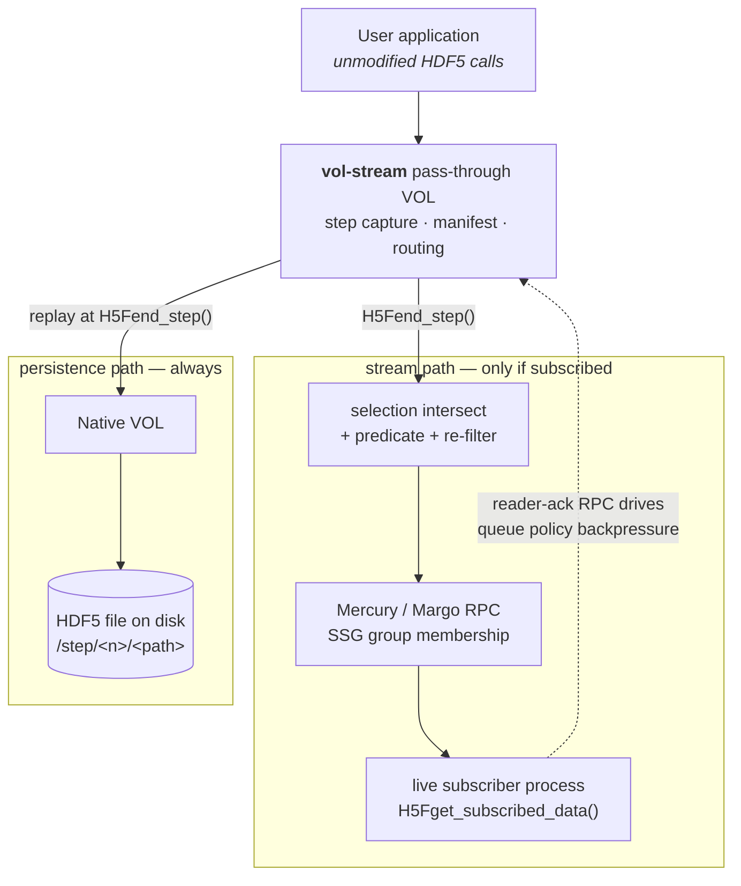

# vol-stream User Guide & Developer Manual

A pass-through HDF5 VOL connector that tees a running application's writes to a
live transport while persisting an ordinary HDF5 file underneath.

This document is self-contained: it is the reference for building, configuring,
using, and troubleshooting the connector, and it does not assume you have read
anything else in this repository.

| | |
|---|---|
| **Connector name** | `vol-stream` (`H5VL_STREAM_NAME`) |
| **Connector value** | `1091` — **provisional**, see [§3.8](#38-a-note-on-the-connector-value) |
| **VOL type** | Pass-through, derived from HDF5's own `src/H5VLpassthru.c` |
| **Default underlying VOL** | Native (POSIX / MPI-IO / Lustre / GPFS) |
| **Streaming transport** | Mercury + Margo + SSG (the [Mochi](https://www.mcs.anl.gov/research/projects/mochi/) stack); optional BAKE for spill |
| **Required HDF5** | **HDF5 2.x (`develop`) only** — see the warning below |
| **Client languages** | C, C++ (via the C API). Python is [partially reachable](#54-example-3-python-h5py-interoperability) |
| **Public header** | [`src/H5VLstream.h`](../src/H5VLstream.h) |
| **License** | Same as HDF5 |

> [!CAUTION]
> **HDF5 1.14 will not work, and the failure is a compile error, not a runtime
> surprise.** The connector calls `H5Tdecode2()` at 8 sites — including the core
> manifest decode path that every replay runs through — and `H5Dread_chunk2()`
> at 5. Neither function exists in 1.14.6, the latest 1.14 release. The
> `find_package(HDF5 1.14 REQUIRED)` line in `CMakeLists.txt` is a floor check
> that predates those calls; it does not mean 1.14 is supported. HDF5 2.x is the
> deliberate and only support target. Supporting 1.14 would mean writing a
> compatibility shim for both APIs *and* changing what the project targets.

> [!IMPORTANT]
> **vol-stream is not a broadcast tee.** Most streaming connectors push every
> write to every consumer and let consumers discard what they did not want.
> vol-stream is **reader-driven**: a consumer declares what it wants with
> `H5Fsubscribe()`, and the writer marshals only that. Nothing goes on the wire
> unless somebody asked for it. The mental model in [§1](#1-architectural-overview--mental-model)
> depends on this, and so does every performance claim in [§7](#7-performance-tuning--best-practices).

---

## Contents

1. [Architectural Overview & Mental Model](#1-architectural-overview--mental-model)
2. [Current State, Scope & Verified Behavior](#2-current-state-scope--verified-behavior)
3. [Installation & Runtime Activation](#3-installation--runtime-activation)
4. [Configuration](#4-configuration)
5. [Code Walkthroughs](#5-code-walkthroughs)
6. [Semantics & Interposition Details](#6-semantics--interposition-details)
7. [Performance Tuning & Best Practices](#7-performance-tuning--best-practices)
8. [Troubleshooting & FAQ](#8-troubleshooting--faq)
9. [Reference](#9-reference)

**Developer manual** — for working on the connector itself:

10. [Internals](#10-internals)
11. [Extending the Connector](#11-extending-the-connector)
12. [Contributing](#12-contributing)

---

## 1. Architectural Overview & Mental Model

### 1.1 What a pass-through streaming VOL is

A VOL connector sits between the HDF5 public API and whatever actually stores
the data. A *pass-through* connector does not store anything itself — it
forwards every callback to an underlying connector (here, native HDF5) and gets
to observe, annotate, or duplicate the operation on its way through.

vol-stream uses that position to run two paths from one `H5Dwrite()`:

- **The persistence path.** The write is replayed into the underlying native
  file, exactly as it would have been without the connector. The file is real
  HDF5, readable by any HDF5 program, forever.
- **The stream path.** If a live consumer has subscribed to the object being
  written, the writer serializes the overlapping elements and pushes them over
  Mercury to that consumer, at commit time.

### 1.2 Why this is a VOL connector and not a VFD

This is worth two paragraphs because it explains a constraint you will meet
later: why a live stream file cannot be read by ordinary tools.

HDF5 shipped a stream VFD once. `H5FDstream.c`, `H5Pset_fapl_stream` and
`H5FD_STREAM` were removed in the 1.8 series. Below the VOL, a write has been
flattened into byte ranges at file offsets, and the layers above keep returning
to offsets they wrote earlier: the chunk index rebalances, the free-space
manager updates, the superblock and object headers are patched, and the metadata
cache reads its own writes back. Every one of those is a seek into data a stream
has already sent. HDF5's mirror VFD is the proof of the rule — it streams bytes
over TCP today and only functions because the far end reconstitutes a fully
seekable file.

At the VOL layer a write is still *described*: dataset, datatype, dataspace,
selection. That description serializes forward-only, and a consumer can select
into it arbitrarily. Two further reasons the VOL layer is the right one: M×N
redistribution needs dataspace knowledge to decide which writer rank's data
satisfies which reader's selection, and a driver sees no dataspaces at all; and
back-pressure must be applied where the application's step boundary is visible,
so a blocked queue stalls the simulation at a defined point rather than inside
an arbitrary metadata flush.

### 1.3 The unit that makes it a stream: the step

HDF5 has no notion of "the state of this file at time *t*". vol-stream adds one,
called a **step**, and it is the connector's single most important concept:

```c
H5Fbegin_step(fid, n_logical, logical_ids, wall_time_ns);
    /* ... ordinary H5Dcreate2 / H5Dwrite / H5Awrite ... */
H5Fend_step(fid);        /* <- the step becomes durable and visible HERE */
```

A step is a transaction. Between `begin` and `end`, captured creates and writes
live in the connector's staging buffer, not in the file. `H5Fend_step()`
validates the step, replays it into the underlying file atomically, and — if
anyone subscribed — pushes the subscribed slices.

> [!WARNING]
> **A step is the unit of durability, so `H5Fflush()` does not commit one, and
> `H5Fclose()` discards an open one.** This is the single most common source of
> "my data vanished". See [§6.1](#61-flush-semantics) and
> [§6.2](#62-close-semantics) for the exact contract and the reasoning.

Writes made **outside** a step are pure pass-through — byte-for-byte identical
to native HDF5, with no capture, no staging, and nothing on the wire. That is
the connector's regression net (asserted byte-identical in the test suite) and
it is also the coarse-grained answer to "how do I stream only some of my
output".

**Logical step ids.** The connector keeps its own monotone physical step
counter. The `logical_ids` you pass are separate and deliberately so: restarting
from a checkpoint replays ids already seen, which one monotone counter cannot
represent. openPMD hit exactly this in production against ADIOS2 — resuming at
iteration 500 after writing through 750 yields `0, 50 … 750, 500, 550`.
`H5Fbegin_logical_step()` resolves an id to the *largest* physical step carrying
it, so a restart's rewrite supersedes the original rather than shadowing it.

### 1.4 VOL stacking architecture



In plain text:

```
  Application (unmodified HDF5)
        |
        v
  vol-stream pass-through VOL
        |
        +--> [ routing: selection ∩ predicate ∩ precision ]
        |         --> Mercury/Margo RPC --> live subscriber(s)
        |                                        |
        |         <---- reader-ack RPC ----------+   (backpressure)
        |
        +--> Native VOL --> HDF5 file on disk  (/step/<n>/<path>)
```

Note the back-arrow. Because subscribers acknowledge steps, the writer knows how
far behind the slowest tracked consumer is, and can apply a
[queue policy](#43-backpressure-and-failure-isolation-the-queue-policy) instead
of either blocking forever or dropping data silently.

### 1.5 What the file on disk actually looks like

> [!CAUTION]
> **This is where the usual pass-through mental model breaks, and you need to
> know it before you plan a workflow.** A step-captured dataset does *not* land
> at its logical path. It lands under a per-step group.

An application that writes `/series` in twenty steps produces this, verified
with HDF5's own `h5ls`:

```
$ h5ls -r example_series.h5
/                        Group
/step                    Group
/step/0                  Group
/step/0/.manifest        Dataset {506}
/step/0/.payload         Dataset {16384}
/step/0/series           Dataset {4096/Inf}
/step/1                  Group
/step/1/.manifest        Dataset {482}
/step/1/.payload         Dataset {16384}
/step/1/series           Dataset {8192/Inf}
...
```

`.manifest` and `.payload` are the connector's bookkeeping. The manifest is a
flatcc (FlatBuffers) envelope around blobs HDF5 produced itself —
`H5Tencode` for the datatype, `H5Sencode2` for the dataspace *including its
selection*, `H5Pencode2` for chunking and the filter pipeline. That is why the
wire representation is exactly as expressive as HDF5's data model, with none of
it hand-written: a consumer reconstructs types and selections with
`H5Tdecode2()`/`H5Sdecode()` rather than interpreting somebody's description of
them.

Everything is present and correct, and every step is a re-readable snapshot —
but "the current value of `/series`" means "whichever step last wrote it". The
`h5stream` tool collapses that for you:

```
$ h5stream export example_series.h5 exported.h5
example_series.h5: exported 1 object(s) from 20 step(s) to exported.h5

$ h5ls -r exported.h5
/                        Group
/series                  Dataset {81920/Inf}
```

`exported.h5` is ordinary HDF5 with no caveats — hand it to ParaView, a plotting
script, or a colleague. See the [tool-compatibility matrix](#81-faq) for all
four states a stream can be in, including the one where no file-reading tool
works at all.

### 1.6 What you get for the overhead

vol-stream is slower per step than a dedicated streaming library (quantified
honestly in [§8.1](#81-faq)). What it buys:

- **No application rewrite for the persistence path.** An unmodified binary
  picks up the connector from environment variables and keeps writing valid
  HDF5. Verified: a plain program that never mentions vol-stream reports
  `file is open through the 'vol-stream' connector` and produces a normal file.
- **Reader-driven narrowing.** Subscription by object, by selection, by
  per-subscriber precision, and by value predicate. A push-based protocol
  structurally cannot do this: it has no back-channel from reader to writer.
- **Full HDF5 fidelity on the wire** — groups, compound and enum types, opaque
  types, attributes, odd byte orders, arbitrary hyperslabs — because the
  manifest carries HDF5's own encodings. `H5T`'s conversion engine handles
  endianness and precision differences between peers, so a heterogeneous stream
  works without the application knowing.
- **Stream and archive as one object.** A step is simultaneously a live stream
  element and a nameable, re-openable revision (`h5stream history` writes an
  onion-VFD archive). You do not choose between "file engine" and "stream
  engine" up front.
- **Spill as a third queue-full policy**, beyond the usual block-or-discard.
- **No HDF5 changes required.** The step API is registered at runtime via
  `H5VLregister_opt_operation()` and invoked through the public
  `H5VLfile_optional_op()`.

---

## 2. Current State, Scope & Verified Behavior

### 2.1 What is implemented

Everything documented in this guide is implemented and exercised by the test
suite unless a callout says otherwise. In summary: step capture and atomic
replay; a decoupled reader with logical-step navigation; the Mercury/Margo
transport with SSG rendezvous and late-joiner seeding; deferred (`H5ES`) write
requests; parallel writers including heterogeneous per-rank object sets and an
optional I/O-concentrator topology; queue policy with reader acknowledgement and
BAKE-backed spill; the subscription protocol with subvolume, per-subscriber
precision, and predicate pushdown; and the `h5stream` tool.

> [!NOTE]
> The `README.md` at the root of this repository still carries a "Status: M1"
> banner and a roadmap table that predate almost all of the above, and its
> `H5Fbegin_step(fid, 1, &step)` snippet is missing the `wall_time_ns` argument
> the current header requires. **This document supersedes it.**

### 2.2 Data-model support

The capture path is largely datatype-agnostic — it copies the buffer
`H5Dwrite`/`H5Awrite` was given into the pending entry — which is correct for
every self-contained type and *not* correct for types that are really pointers.
Those are handled explicitly:

| Datatype | Status | Notes |
|---|---|---|
| Atomic fixed-size (integer, float, bitfield, opaque) | **Full** | Plain capture and replay |
| Compound, array, enum of fixed-size members | **Full** | |
| Committed (named) datatypes | **Full** | |
| Strings, fixed-length | **Full** | |
| Variable-length (`H5T_VLEN`), top level | **Full** | Deep-serialized at capture: the connector follows the `hvl_t` pointers immediately and copies what they point at, then rebuilds real pointers at replay. You may free your buffers before `H5Fend_step()` |
| Variable-length strings, top level | **Full** | Same mechanism |
| **VL nested inside a compound or array** | **Rejected** | The write returns -1 with a clear error. Deep-serializing these means walking a nested layout member by member, which the connector does not do |
| **VL whose base type is itself variable-length** | **Rejected** | Same reason |
| Object/region references, top level | **Full**, same-file | Captured by plain memcpy. `H5Rcreate_object(fid, "/target")` works with the *logical* path — the connector translates logical→physical in the object-lookup path |
| **Reference to a target created in the same step** | **Refused** | Deferred writes mean the target is genuinely not in the underlying file until `H5Fend_step()` replays the manifest. **Reference targets must come from an earlier, committed step** |
| Attributes | **Full** | Including type conversion; attribute paths are `"@"`-joined and independently subscribable |

> [!TIP]
> A rejected write does not poison the rest of the step. A plain write to a
> different object in the same step still replays correctly, so you can handle
> the `-1` and carry on.

### 2.3 Known limitations

Stated plainly so you can plan around them:

- **A live file cannot be read by any file-reading tool.** Not a bug, not
  fixable: while a writer holds an HDF5 file open, a second process cannot read
  it. Use the transport (`h5stream tail`, or a subscriber). See
  [§8.1](#81-faq).
- **A reader's step index does not grow live.** `H5Fwait_step_ready()` tells you
  a step committed, but reading that step's data through the file requires
  reopening the file. The subscription path
  (`H5Fsubscribe`/`H5Fget_subscribed_data`) is the live data channel; the
  reader-cursor path is for finished or reopened streams.
- **Per-subscriber re-filtering ignores a requested chunk *shape*.** It always
  builds a single chunk spanning the pushed run. This affects how a re-filtered
  push is stored in transit, not which elements are chosen.
- **`h5py` cannot open a step.** The step API is optional operations; `h5py` has
  no binding for `H5VLfile_optional_op()`. See [§5.4](#54-example-3-python-h5py-interoperability).
- **`h5dump` cannot address a past revision of an archive.** `--vfd-name onion`
  exists but `--vfd-info` is cast straight to `H5FD_onion_fapl_info_t *`, so
  there is no way to spell a revision number on the command line. Measured:
  `h5dump --vfd-name onion` on an archive prints the empty canonical file. A few
  lines of C with `H5Pset_fapl_onion()` reach any revision.
- **The connector adds no thread safety of its own.** See [§7.6](#76-hdf5-thread-safety).
- **One transport test is built and passing but disabled by default** in
  `ctest`. Mercury's single progress ULT can block inside an unbounded
  `connect()` in libfabric's TCP provider while reaching for an already-departed
  peer during teardown. It never produces a wrong answer and never crashes — it
  occasionally stalls process teardown past a normal test timeout.

### 2.4 Wire-format compatibility

Because the manifest leans on `H5Tencode`/`H5Sencode2`/`H5Pencode2`, the wire
format is coupled to HDF5's encoding rules, and `H5Sencode2` has already changed
once (widening selections to 64-bit).

The connector defends against that: each manifest records the `hdf5_version`
that wrote it, and replay compares it against the running library's major.minor
before any decode call runs, refusing with a clear `stderr` diagnostic rather
than handing incompatible bytes to `H5Tdecode2()`. The release/patch digit is
ignored, since HDF5's versioning policy never lets encoding format change there.

One field is not HDF5's own encoding: the VL wire form's per-element length tag,
`[uint64 tag][tag-1 bytes]` per element, where `tag == 0` marks a NULL pointer
(the +1 bias keeps NULL distinguishable from a legitimately empty sequence or
`""`, which HDF5 round-trips differently). It is written and read as explicit
little-endian, matching FlatBuffers' own specification.

### 2.5 How the behavior in this guide is verified

The `ctest` suite has 44 targets. The load-bearing ones, and what each pins:

| Test | Asserts |
|---|---|
| `smoke` | The connector loads, is actually the one in use, round-trips data, and has its step operations registered and queryable |
| `step` | The same content written three ways — native, through the connector, and through the connector with every write in a step — is **byte-identical** across all three files. Also exercises the step state machine including the calls that must be refused |
| `replay` | The replay invariant: what a step said it captured is what landed |
| `api_conformance` | HDF5's own `test/API` suite, run natively and through the connector, required to be **indistinguishable** — not merely passing, since a pass quietly becoming a skip is the regression this catches |
| `vl_roundtrip` | Ragged VL lengths (0, 1, many) and the empty string, checked through the *native* connector, with every application buffer freed **before** `H5Fend_step()` runs. Also asserts the stored length tag is little-endian, so a byte-order regression fails on any host |
| `vl_reject` | Exactly the remaining rejection boundary — nested VL — and that a rejected write leaves the rest of the step intact |
| `ref_path`, `ref_roundtrip` | Logical-path references resolve; a same-step target is still refused |
| `parallel`, `parallel_7x3` | Byte-exact parallel writes at coprime rank counts (7 writers/3 readers, 64/5) |
| `parallel_concentration*` | The concentrator actually logged writing on another rank's behalf rather than silently no-op'ing |
| `queue_policy`, `parallel_lag` | Block/Discard/Spill behavior under real reader lag |
| `subscribe`, `predicate`, `subvolume_*`, `precision*` | The routing narrowings, including that an unsubscribed sibling object is never sent |
| `plugin_scratch` | The `HDF5_VOL_CONNECTOR` path specifically — the one configuration where the connector's internal scratch files could recurse back into itself |

> [!NOTE]
> Byte-identity needs `H5Pset_obj_track_times(..., false)` on both the FCPL and
> the DCPL. Object headers store four timestamps by default, and disabling them
> on the dataset alone is not enough because the root group is created with the
> file — so two otherwise identical files written seconds apart differ in 8
> bytes. The `step` test also tampers with a copy and requires the comparison to
> catch it, so a passing byte-identity assertion means something.

CI covers these axes:

| Axis | Values |
|---|---|
| HDF5 version | `develop` only (see the compile-error warning at the top) |
| MPI | MPICH · OpenMPI |
| Mercury NA plugin | `na+sm` · `ofi+tcp` · `ofi+verbs` |
| Rank shapes | 3→2 · 7→3 (coprime, where M×N projection bugs surface) |
| Sanitizers | ASan · UBSan · TSan |
| Spack environment | pinned lockfile · floating latest |

---

## 3. Installation & Runtime Activation

### 3.1 Prerequisites

| Component | Requirement | Needed for |
|---|---|---|
| **HDF5** | **2.x (`develop`)** — not 1.14, which does not compile | Everything |
| CMake | 3.18+ | Build |
| MPI | Any implementation | Parallel writers only |
| Mercury, Argobots, mochi-margo, mochi-ssg | found via `pkg-config` | The transport: subscriptions, `H5Fwait_step_ready()`, `h5stream tail`, queue policy |
| bake-client, bake-server, abt-io, PMDK | found via `pkg-config` | `H5VL_STREAM_QUEUE_SPILL` only |

Without the Mochi stack the connector still builds and works — you get step
capture, replay, the reader cursor, and the tools' offline subcommands. You do
not get any live channel.

Versions the CI builds against, if you are assembling the stack by hand:
argobots 1.2, mercury 2.3.1, mochi-margo 0.17.0, mochi-ssg 0.5.4, PMDK 2.1.1,
mochi-abt-io 0.9.0, mochi-bake 0.6.4. `mochi-margo` is a builtin Spack package.

### 3.2 Build

```bash
cmake -S . -B build -DCMAKE_PREFIX_PATH=/path/to/hdf5-install
cmake --build build
ctest --test-dir build --output-on-failure
```

Against an **uninstalled HDF5 build tree** — normal when working on the library
itself, and something `find_package` cannot locate — supply both variables to
skip discovery:

```bash
cmake -S . -B build \
  -DHDF5_C_LIBRARIES=/path/hdf5/build/bin/libhdf5.so \
  -DHDF5_INCLUDE_DIRS="/path/hdf5/src;/path/hdf5/build/src;/path/hdf5/src/H5FDsubfiling"
```

> [!NOTE]
> The third include directory is needed because an in-tree `hdf5.h` includes
> `H5FDsubfiling.h` from its own subdirectory; an install flattens that.

Build options:

| Option | Default | Effect |
|---|---|---|
| `VOL_STREAM_ENABLE_MERCURY` | `AUTO` | `ON` requires the transport and fails configuration if it is missing; `OFF` builds without it |
| `VOL_STREAM_ENABLE_BAKE` | `AUTO` | As above, for the BAKE spill target. Implies Mercury |
| `VOL_STREAM_ENABLE_LOGGING` | `OFF` | Log every VOL callback to stdout. Very verbose; a debugging aid |
| `VOL_STREAM_BUILD_TESTS` | `ON` | Build the test programs |
| `VOL_STREAM_BUILD_EXAMPLES` | `ON` | Build `examples/` (gated on Mercury being present) |
| `VOL_STREAM_SIGN_KEY` | unset | Sign the plugin as a post-build step; see [§3.7](#37-signed-plugins) |

### 3.3 Linking an application

Linking against the connector needs HDF5, `libvol_stream.so`, and — because
`libvol_stream.so` itself depends on them — the Mochi libraries:

```bash
cc -O2 -o my_writer my_writer.c \
   -I/path/hdf5/include -I/path/vol-stream/src \
   -L/path/vol-stream/build -lvol_stream \
   -L/path/hdf5/lib -lhdf5 \
   -lssg -lmargo -lmercury -lna -lfabric -labt -lbake-client -lbake-server -labt-io
```

> [!TIP]
> If the loader reports `libbake-client.so.0: cannot open shared object file`
> even though you passed `-Wl,-rpath`, you have hit `RUNPATH` semantics:
> `--enable-new-dtags` (the default on most modern toolchains) makes the
> executable's `RUNPATH` apply to *its* direct dependencies only, not to
> `libvol_stream.so`'s dependencies. Either set `LD_LIBRARY_PATH` at runtime or
> ensure `libvol_stream.so` carries its own `RUNPATH`.

### 3.4 Activation by environment variable (no code changes)

```bash
export HDF5_PLUGIN_PATH=/path/to/vol-stream/build
export HDF5_VOL_CONNECTOR="vol-stream"
./your_hdf5_application
```

The connector name may be followed by a configuration string that names the
underlying connector explicitly. Both forms are verified working:

```bash
# Implicit: under-VOL defaults to native
export HDF5_VOL_CONNECTOR="vol-stream"

# Explicit: under_vol=0 is the native connector's class value,
# under_info={} is its (empty) info string
export HDF5_VOL_CONNECTOR="vol-stream under_vol=0;under_info={}"
```

> [!WARNING]
> The configuration-string parser requires the `under_info={...}` braces to be
> present whenever you supply a configuration string at all. `"vol-stream
> under_vol=0"` without braces is not a valid string.

To confirm the stack is actually in place rather than silently falling back to
native, ask the file which connector it went through:

```c
char name[64];
H5VLget_connector_name(fid, name, sizeof(name));   /* takes an OBJECT id, not a VOL id */
printf("connector: %s\n", name);                   /* -> "vol-stream" */
```

Add the transport, and the connector gains its live channel:

```bash
export VOL_STREAM_NA="ofi+tcp"     # or na+sm, ofi+verbs, ...
```

### 3.5 Activation programmatically (C API)

```c
#include "hdf5.h"
#include "H5VLstream.h"

H5VL_stream_info_t info;
hid_t vol_id, under_vol_id, fapl;

/* 1. Register the connector. Returns its hid_t. */
if ((vol_id = H5VL_stream_register()) < 0)
    /* handle error */;

/* 2. Name the connector to chain underneath. This returns a NEW, ref-counted
 *    id -- do not pass the H5VL_NATIVE macro here. */
if ((under_vol_id = H5VLget_connector_id_by_name("native")) < 0)
    /* handle error */;

info.under_vol_id   = under_vol_id;
info.under_vol_info = NULL;

/* 3. Stack it on the FAPL. */
if ((fapl = H5Pcreate(H5P_FILE_ACCESS)) < 0)
    /* handle error */;
if (H5Pset_vol(fapl, vol_id, &info) < 0)
    /* handle error */;

/* ... H5Fcreate/H5Fopen with this fapl ... */

H5Pclose(fapl);
H5VLclose(under_vol_id);
H5VLclose(vol_id);
```

> [!TIP]
> `H5Pset_vol(fapl, vol_id, NULL)` — a NULL info — is the shorthand: it defaults
> the under-VOL to native and is what every test and example in this repository
> uses. Supply the struct only when you are chaining something other than
> native, or when you want the chain to be explicit in the source.

> [!WARNING]
> Do not write `info.under_vol_id = H5VL_NATIVE;`. The connector's `info_copy`
> callback increments the reference count on the id it is handed and expects to
> own that reference; passing the library's own macro fails inside
> `H5Pset_vol()` with `connector info copy failed`. Use
> `H5VLget_connector_id_by_name("native")`, which hands back an id you own and
> close yourself.

> [!NOTE]
> **The function is `H5Pset_vol()`.** There is no `H5Pset_vol_connector()` in
> HDF5 — if you are searching for that name, `H5Pset_vol()` is what you want.
> Checked against `H5Ppublic.h`, where the declaration is
> `herr_t H5Pset_vol(hid_t plist_id, hid_t new_vol_id, const void *new_vol_info)`.

**From C++.** There is no separate C++ API; use the C API directly.
`H5VLstream.h` wraps its declarations in `extern "C"`, so including it from a
`.cpp` translation unit works with no shim.

> [!WARNING]
> Do not let an exception propagate out of an open step. `H5Fclose()` discards
> an open step silently ([§6.2](#62-close-semantics)), so an unwind that skips
> `H5Fend_step()` loses that step's data with no diagnostic.

### 3.6 Chaining other pass-through connectors

`H5VL_stream_info_t.under_vol_id` is the chain pointer. Set it to another
pass-through connector's id instead of native's and the chain continues
downward — vol-stream over Async VOL over native, for example.

Two cautions. This repository's testing is against native as the under-VOL, so
other stacks are not part of the verified matrix. And ordering matters, because
vol-stream's replay issues real HDF5 calls into whatever is beneath it at
`H5Fend_step()` time.

### 3.7 Signed plugins

HDF5 can verify an RSA signature on a plugin before `dlopen`-ing it. When the
HDF5 in use was built with `-DHDF5_REQUIRE_SIGNED_PLUGINS=ON`, an unsigned
`vol-stream` is rejected, and the error does not obviously say "unsigned":

```
H5PL__find_plugin_in_path(): search in directory failed
H5PL__open(): plugin signature verification failed for: .../libvol_stream.so
H5PL__verify_signature_appended(): cannot read or validate signature footer
H5PL__read_and_validate_footer(): not a signed HDF5 plugin (bad magic or
                                  unsupported format version)
```

It reads like a corrupt or incompatible plugin. The connector is fine; the
loader simply will not accept it.

> [!NOTE]
> This affects the **plugin path only**. An application that links the connector
> and calls `H5VL_stream_register()` never goes through the plugin loader, so it
> is unaffected.

**Check whether your HDF5 enforces it:**

```bash
grep HDF5_REQUIRE_SIGNED_PLUGINS /path/to/hdf5-build/CMakeCache.txt
```

The HDF5 default is `OFF`. If a build has it `ON` and you control that build,
turning it off is the simplest fix for a development setup:

```bash
cmake -S /path/to/hdf5 -B /path/to/hdf5-build -DHDF5_REQUIRE_SIGNED_PLUGINS=OFF
cmake --build /path/to/hdf5-build
```

**Signing instead**, when enforcement has to stay on. Generate a key pair — do
not commit either file; `.gitignore` excludes `*.pem` and `keystore/` for this
reason:

```bash
openssl genpkey -algorithm RSA -pkeyopt rsa_keygen_bits:4096 -out dev_private.pem
chmod 600 dev_private.pem
mkdir -p keystore
openssl rsa -in dev_private.pem -pubout -out keystore/dev_public.pem
```

Have the build sign the plugin as a post-build step:

```bash
cmake -S . -B build \
  -DCMAKE_PREFIX_PATH=/path/to/hdf5-install \
  -DVOL_STREAM_SIGN_KEY=$PWD/dev_private.pem
cmake --build build
```

The build invokes `h5sign -f`, so an incremental rebuild re-signs rather than
failing on the previous signature. If `h5sign` is not on `PATH` or under
`${HDF5_ROOT}/bin`, point at it with `-DH5SIGN_EXECUTABLE=/path/to/h5sign`.

Then run with the keystore visible:

```bash
export HDF5_PLUGIN_PATH=$PWD/build
export HDF5_PLUGIN_KEYSTORE=$PWD/keystore
export HDF5_VOL_CONNECTOR="vol-stream"
```

A keystore may hold public keys from several developers; HDF5 accepts the plugin
if any key verifies it.

> [!WARNING]
> Two traps. **A stale unsigned copy shadowing the signed one:**
> `HDF5_PLUGIN_PATH` is searched as a directory, so a leftover unsigned
> `libvol_stream.so` beside the signed one can be the copy that gets tried and
> rejected — keep one plugin per directory when debugging this. **A locked
> keystore:** if HDF5 was built with `-DHDF5_LOCK_PLUGIN_KEYSTORE=ON`, the
> `HDF5_PLUGIN_KEYSTORE` environment variable is ignored and only the
> compile-time `HDF5_PLUGIN_KEYSTORE_DIR` applies, so the public key has to go
> in the directory chosen when HDF5 was built.

### 3.8 A note on the connector value

`H5VL_STREAM_VALUE` is **1091, and provisional.** Values below `H5_VOL_RESERVED`
(256) are reserved for the HDF5 library; anything at or above it is available,
but there is no automatic collision check between third-party connectors. An
official value should be requested from The HDF Group before any release. If you
deploy alongside other out-of-tree connectors, prefer registering by *name*.

---

## 4. Configuration

vol-stream's configuration splits three ways, and it is worth being explicit
about the split up front because it does not match the usual pass-through
connector layout:

| Configured through | What it controls |
|---|---|
| **FAPL** (`H5Pset_vol`) | Which connector stack this file uses, and what it chains to |
| **Environment variables** | Transport endpoint, staging, spill location, concentrator topology |
| **Runtime API calls** | Queue policy (writer), subscriptions and predicates (reader) |

> [!NOTE]
> **There is no DXPL property that marks a dataset for streaming.** If you came
> looking for a per-write "stream this one" flag, [§4.4](#44-selective-streaming)
> explains what to use instead — the answer is genuinely different, not merely
> spelled differently.

### 4.1 Transport and staging (environment)

| Variable | Values | Default | Effect |
|---|---|---|---|
| `VOL_STREAM_NA` | Mercury NA string: `na+sm`, `ofi+tcp`, `ofi+verbs`, … | unset | **Opts a file into the transport.** Unset means no live channel at all: no subscriptions, no `H5Fwait_step_ready()`, no queue policy, no `h5stream tail` |
| `VOL_STREAM_STAGE_PAYLOAD` | `0`/`n`/`f` to disable | enabled | Whether each step persists a `/step/<n>/.payload` staging dataset. Disabling it is the single biggest write-side speedup — see [§7.1](#71-the-payload-staging-knob) |
| `VOL_STREAM_MAX_PENDING_BYTES` | byte count | unlimited | Caps the connector's in-step staging buffer |
| `VOL_STREAM_SPILL_DIR` | directory path | `/tmp` | Where `H5VL_STREAM_QUEUE_SPILL` writes node-local bytes |
| `VOL_STREAM_CONCENTRATION` | integer > 1 | `1` (off) | Subfiling-style I/O-concentrator topology for parallel writers: N ranks funnel their writes through one |
| `VOL_STREAM_PUSH_STATS` | any non-`0` value | off | Report per-push timing from the transport |
| `VOL_STREAM_DEBUG_REFILTER` | any value | off | Trace per-subscriber re-filtering |
| `VOL_STREAM_DEBUG_PREDICATE` | any value | off | Trace predicate evaluation |

> [!TIP]
> `na+sm` (shared memory) is the fastest local option but its zero-copy path
> needs cross-memory attach (`process_vm_readv`/`writev`), which many kernels
> disable by default (`kernel.yama.ptrace_scope != 0`). On such a machine
> `na+sm` does not merely run slower — **group rendezvous can hang**. Use
> `ofi+tcp` unless you have confirmed `ptrace_scope` is `0`.

> [!NOTE]
> **There is no worker-thread-count knob, and this is not an omission.** The
> connector spawns no threads of its own; Margo owns the progress engine and
> runs Argobots user-level threads inside the transport, which is where any
> concurrency tuning would have to happen. Tune Margo directly if you need to.
> The only pool this connector sizes is the in-step staging buffer
> (`VOL_STREAM_MAX_PENDING_BYTES`) — see [§7.3](#73-decoupling-disk-from-network)
> for how it pairs with `reserve_slots` to bound memory.

### 4.2 Rendezvous

There is no broker to configure and no contact file to manage by hand. A writer
creates an SSG group at `H5Fcreate()`/`H5Fopen()` time and writes its group id
to a sidecar file next to the data file:

```
example_series.h5           <- the HDF5 file
example_series.h5.vsgroup   <- the SSG group id, how consumers find the writer
```

A consumer loads the sidecar and joins. SSG's SWIM failure detector handles
liveness, so a consumer that dies is simply absent from the next group view —
there is no vol-stream-level liveness tracking and no risk of a dead consumer
stalling the writer. A consumer that joins mid-stream is seeded with the
writer's current step, so its first `H5Fwait_step_ready()` returns immediately
rather than blocking for a write it already missed.

> [!IMPORTANT]
> **The sidecar is the handshake.** A consumer must wait for
> `<filename>.vsgroup` to appear before calling `H5Fopen()`. Opening earlier
> fails; there is no retry loop inside the connector.

### 4.3 Backpressure and failure isolation: the queue policy

This is vol-stream's answer to the strict-versus-best-effort question, and it is
a more precise instrument than either. It governs what `H5Fend_step()` does when
a tracked consumer falls behind:

```c
herr_t H5Fset_stream_queue_policy(hid_t file_id,
                                  H5VL_stream_queue_policy_t policy,
                                  uint64_t reserve_slots);
```

| Policy | `H5Fend_step()` behavior when a consumer lags | Data loss | Analogous to |
|---|---|---|---|
| *(none — the default)* | Unconditional synchronous durable replay. Lag is not even measured | None | — |
| `H5VL_STREAM_QUEUE_BLOCK` | Waits for the consumer to catch up | None — the replay invariant holds for every step | Strict: the network throttles the application |
| `H5VL_STREAM_QUEUE_DISCARD` | Returns immediately; **the step's data is dropped entirely**. The physical step still exists so later steps stay reachable, but it carries nothing | Yes, deliberately | Fail-soft with bounded memory |
| `H5VL_STREAM_QUEUE_SPILL` | Returns immediately; writes the step's manifest and payload to node-local storage instead of the (congested) shared file. A later `H5Fend_step()` drains the spill once the consumer recovers | None, deferred | Fail-soft with no loss |

`reserve_slots` is how many steps a consumer may lag before the policy applies;
`0` applies it the moment any tracked consumer is not caught up.

Spill is the option a purely in-memory queue cannot offer, and it is why the
policy set here is three rather than two: node-local NVMe exists on every
exascale machine, so "stall the simulation" and "lose science" are not the only
two answers when the queue fills.

Three behaviors worth knowing:

- **"Tracked" has a precise meaning.** A consumer becomes tracked once it sends
  its first ack, which happens automatically after a sequential
  `H5Fbegin_step()` advance. A consumer that only ever jumps with
  `H5Fbegin_logical_step()` — a monitoring or latest-only consumer — never acks,
  is therefore never counted as behind, and cannot apply backpressure to the
  writer regardless of policy. That is the intended design for monitors.
- **Spill degrades gracefully.** Built without BAKE, `SPILL` falls back to
  `DISCARD`'s behavior. In a parallel writer it degrades to `BLOCK`.
- **A step with an open placeholder object is never spilled or discarded.** If
  the application holds a handle from `H5Dcreate2()` across `H5Fend_step()`,
  that step always gets the full immediate replay whatever the policy says.

> [!NOTE]
> **Transport startup is separately, and unconditionally, fail-soft.** If
> `VOL_STREAM_NA` is set but the transport cannot start, `H5Fcreate()` /
> `H5Fopen()` **still succeed** and the file works normally with no live
> channel. This is deliberate and load-bearing in parallel: one rank losing its
> transport is a supported state, and the queue-policy region is gated by an
> `MPI_Allreduce` so ranks cannot disagree about whether to enter a collective.
> If you require the stream, check for it — do not assume a successful
> `H5Fcreate()` means you have one.

### 4.4 Selective streaming

Selectivity is expressed in two places, neither of them a DXPL.

**Writer side — the step bracket.** Writes inside `H5Fbegin_step()` /
`H5Fend_step()` are captured, replayed, and eligible for streaming. Writes
outside it are pure pass-through: identical to native HDF5, no capture, no
network. Bracket only the variables you want to be part of the stream, and write
diagnostics or checkpoints outside the bracket to keep them off the wire
entirely.

**Reader side — the subscription.** The consumer declares interest and the
writer marshals only that:

```c
herr_t H5Fsubscribe(hid_t file_id, size_t count, const char *const *paths,
                    const hid_t *spaces, const hid_t *plists);

herr_t H5Fsubscribe_predicate(hid_t file_id, const char *path,
                              H5VL_stream_pred_op_t op, hid_t type_id,
                              const void *value);
```

| Narrowing | Set by | Effect |
|---|---|---|
| **By object** | `paths` | An unsubscribed sibling object in the same step is never sent |
| **By region** | `spaces` | The encoded *selection* travels to the writer, which intersects it with each write and sends one push per contiguous run. A column of a 2-D dataset receives its own elements, not a superset |
| **By precision** | `plists` (a DCPL) | The writer re-filters that subscriber's slice through the requested pipeline before sending. Two subscribers to one object can receive it at different precisions, and the object need not be filtered on disk at all. Reversal is transparent — you always get decoded values back |
| **By value** | `H5Fsubscribe_predicate()` | The writer evaluates the test against the bytes it is about to marshal. **A write in which nothing matches produces no RPC at all** — the only narrowing here that reaches zero bytes |

Predicate operators: `H5VL_STREAM_PRED_LT`, `_LE`, `_GT`, `_GE`, `_EQ`, `_NE`.
The predicate is deliberately a value test against one scalar constant and
nothing more; anything richer (ranges, conjunctions, expressions over several
objects) would be a query language, and HDF5 has no `H5Q`/`H5X` in the tree to
borrow one from.

Comparison happens in the data's own class — `long long` for integers, `double`
for floats — with your constant converted by HDF5's own conversion engine. A
floating-point constant against integer data is truncated toward zero by that
conversion, so prefer a constant of the same class as the data.

> [!WARNING]
> **Over-sending is inefficiency; under-sending is data loss — the connector
> always chooses the former.** A predicate against data it cannot evaluate (a
> compound, a string, a `uint64` whose values exceed `LLONG_MAX`, a float wider
> than `double`) is silently ignored and the whole overlap is sent. A selection
> or match set too fragmented to describe in a bounded number of runs is
> coalesced to its bounding span. **A consumer that must see only matching
> elements should re-test what arrives** rather than treat delivery as proof of
> a match.

> [!CAUTION]
> A later `H5Fsubscribe()` naming the same path **clears** that path's
> predicate. Re-subscribe first, then re-apply the predicate — never the
> reverse.

### 4.5 Composing with VFD SWMR

> [!NOTE]
> **Proof of concept: this works, and was measured.** Results in
> [§4.5.4](#454-proof-of-concept-results). It is still not in CI and not a
> supported configuration — one run of one workload is not a support statement —
> but it is no longer speculation.

**They are at different layers, so they do not compete.** vol-stream is a VOL
connector; VFD SWMR is a virtual *file driver*. The natural stack is
`vol-stream → native VOL → VFD SWMR`.

**They compose mechanically, with no connector changes**, because of how the
connector propagates the FAPL. `H5VL_stream_file_create()`/`_file_open()` copy
the application's FAPL wholesale and override only the VOL:

```c
under_fapl_id = H5Pcopy(fapl_id);
H5Pset_vol(under_fapl_id, info->under_vol_id, info->under_vol_info);
```

`H5Pset_vfd_swmr_config()` is a FAPL property, so a configuration you set is
carried through to the native connector untouched.

**It is the one SWMR variant whose central objection does not apply.** Classic
SWMR forbids structural change, which rules it out immediately — vol-stream
creates a new `/step/<n>/` group on every commit ([§8.1](#81-faq)). VFD SWMR
*permits* writers to create and delete objects, so that reasoning does not
transfer.

> [!WARNING]
> **Do not assume the rest of VFD SWMR's constraints transfer either.** This
> project has already made that mistake in the opposite direction: an early
> decision excluded VL data because VFD SWMR hit a wall with it, and that was
> overturned on the grounds that *VFD SWMR's problem is concurrent metadata in a
> shared file, while a connector serializing its own payload never touches the
> global heap*. Reason about each interaction on its own merits.

#### Availability

VFD SWMR is not in mainline HDF5 2.x. It lives on a port branch
(`feature/vfd-swmr-port`) that merges `upstream/develop`, which matters here:
that tree carries **both** VFD SWMR and the `H5Tdecode2()`/`H5Dread_chunk2()`
APIs vol-stream requires ([§3.1](#31-prerequisites)). It is therefore the one
build where the two can coexist at all. On a stock HDF5 2.x there is nothing to
compose with.

#### Configuration sketch

```c
H5F_vfd_swmr_config_t config = {0};

config.version                 = H5F__CURR_VFD_SWMR_CONFIG_VERSION;
config.tick_len                = 4;      /* tenths of a second -> 0.4 s */
config.max_lag                 = 7;      /* ticks -> 2.8 s at the above */
config.writer                  = true;   /* false in the reader process */
config.maintain_metadata_file  = true;
config.flush_raw_data          = true;   /* see the warning below */
config.md_pages_reserved       = 128;
strlcpy(config.md_file_path, "./my_md_file", sizeof(config.md_file_path));

H5Pset_vfd_swmr_config(fapl, &config);   /* then H5Pset_vol(fapl, vol_id, NULL) */
```

#### Interactions to watch

| Interaction | Why it matters here |
|---|---|
| **`flush_raw_data`: set it true, but it was not decisive here** | It flushes raw data at every tick boundary, and a step's content *is* raw data — so the expectation is that clearing it leaves a reader seeing structure without contents. **Measured, that did not happen**: with `flush_raw_data = false` the reader still read every step's data correctly ([§4.5.4](#454-proof-of-concept-results)). Plausibly because `H5Fvfd_swmr_end_tick()` after each `H5Fend_step()` pushes everything out anyway. Leave it true — but do not assume it is what is protecting you |
| **`H5Fflush()` gets slower *and* still does not commit a step** | Under VFD SWMR, `H5Fflush()` may take up to `max_lag` ticks to complete. vol-stream separately guarantees it does not publish an open step ([§6.1](#61-flush-semantics)). The two surprises stack: a call that is both slow and does not do what its name suggests |
| **`H5Fvfd_swmr_end_tick()` is the natural partner to `H5Fend_step()`** | It ends the current tick early, publishing immediately rather than at the next boundary. Calling it right after `H5Fend_step()` is how a step becomes visible without waiting out `tick_len`. Use sparingly — it shortens the tick for everyone |
| **Two independent lag windows, in different units** | `max_lag` counts **ticks** (wall-clock) and is enforced by the VFD; `reserve_slots` counts **steps** and is enforced by vol-stream's queue policy ([§4.3](#43-backpressure-and-failure-isolation-the-queue-policy)). They do not know about each other, and a configuration where one is far tighter than the other will be governed entirely by that one |
| **Writer and reader must agree** | `tick_len` and `max_lag` must be identical in both processes — the upstream guide recommends sharing one configuration file |
| **The connector's reader index still will not grow live** | It is built by scanning at open time ([§2.3](#23-known-limitations)). VFD SWMR making new steps *visible in the file* does not make the connector notice them; that would need index rebuilding on refresh, which does not exist |

#### 4.5.4 Proof-of-concept results

Measured 2026-08-16 against the `feature/vfd-swmr-port` tree, Debug build,
MPICH, serial. vol-stream built against that HDF5 with
`-DVOL_STREAM_ENABLE_MERCURY=OFF` — **no transport involved**, which is the
point: this tests the file path alone.

**Setup.** A writer running vol-stream over native over VFD SWMR, committing 12
steps of a growing `/series` dataset, calling `H5Fvfd_swmr_end_tick()` after each
`H5Fend_step()`. A **separate process** using the plain native VOL (not
vol-stream, whose reader index does not grow live) polling the same file while
the writer held it open.

| Arm | Result |
|---|---|
| **Control — no VFD SWMR** | Reader opened the file (locking disabled) but `/step` **never became visible at all**: step count stayed at "not found" for the whole run. This is the documented baseline |
| **VFD SWMR enabled** | Reader saw the step count grow **2 → 12 live**, and read each new step's dataset successfully: 10/10 content reads correct |

The content reads are the part that matters — structure appearing is not the
same as data being readable. Sample output:

```
reader: opened the live file (VFD SWMR ON)
reader: first observation: 2 step(s) visible
reader: 2 -> 3  read /step/2/series: 768 elems, first=0 last=767  [DATA OK]
reader: 3 -> 4  read /step/3/series: 1024 elems, first=0 last=1023  [DATA OK]
...
reader: 11 -> 12 read /step/11/series: 3072 elems, first=0 last=3071  [DATA OK]
reader: live content reads: 10 ok, bad=0
reader: RESULT=live-growth-and-data-verified
```

Element counts confirm vol-stream's carry-forward is intact under VFD SWMR:
step 11 holds 3072 = 12 × 256 elements, a complete snapshot, even though the
writer only ever wrote the 256-element tail.

**What this establishes:** the two compose with **no connector changes**;
vol-stream compiles and runs against the port; and a second process can read a
live vol-stream file — structure and data — which is impossible without VFD
SWMR.

**What it does not establish:** anything about parallel writers, larger or
chunk-filtered workloads, long runs, crash consistency, or behavior under a
Release build. It is one workload, once.

> [!CAUTION]
> **Configuration trap, hit while building this PoC.** `md_file_path` is a
> **directory** and `md_file_name` is the shadow file's name — two separate
> fields, populated independently (see `init_vfd_swmr_config()` in HDF5's own
> `test/vfd_swmr_common.c`). Passing a full path as `md_file_path` and leaving
> `md_file_name` empty makes `H5Fcreate()` fail, and in a Debug build that
> surfaces as an assertion inside HDF5 rather than a clean error:
>
> ```
> H5Fint.c:1478: H5F__dest: Assertion `H5AC_cache_is_clean(f, H5AC_RING_MDFSM)' failed.
> ```
>
> This looks like a library bug and is not one. It reproduces with plain native
> HDF5 and no vol-stream in the stack, which is the fastest way to confirm the
> connector is not implicated. Also set `H5Pset_file_space_page_size(fcpl, 4096)`
> to match `H5Pset_page_buffer_size()`; their own test configs set both.

#### What it can and cannot buy

**Can:** live, same-filesystem visibility of the *persistence* path — a reader
watching `/step/<n>/` groups appear and reading their contents, which is
otherwise impossible while the writer holds the file ([§8.1](#81-faq)).
**Demonstrated**, see above.

**Cannot:** anything reader-driven. Subscription, predicate pushdown,
per-subscriber precision, and queue-policy backpressure all require a
**reader → writer back-channel**, and a shared-filesystem mechanism has none. It
can only ever deliver the whole file, eventually visible — the push model this
project deliberately did not build ([§1.6](#16-what-you-get-for-the-overhead)).

The honest summary: VFD SWMR is a plausible second delivery path for local
readers of the persistence side, and no substitute at all for the transport.

---

## 5. Code Walkthroughs

Examples 1 and 2 below were compiled with `-Wall -Wextra` and run end-to-end
against HDF5 2.3.0 with `VOL_STREAM_NA=ofi+tcp`. Their output is reproduced
verbatim from those runs.

### 5.1 The shape of a streaming program

Before the full listings, the skeleton both sides share:

```c
/* Writer                              | Reader / consumer                     */
vol_id = H5VL_stream_register();       | vol_id = H5VL_stream_register();
H5Pset_vol(fapl, vol_id, NULL);        | H5Pset_vol(fapl, vol_id, NULL);
fid = H5Fcreate(..., fapl);            | wait for "<file>.vsgroup" sidecar
                                       | fid = H5Fopen(..., H5F_ACC_RDONLY, fapl);
   /* wait for consumer handshake */   | H5Fsubscribe(fid, 1, paths, &space, NULL);
                                       | H5Fsubscribe_predicate(...);  /* optional */
for each step:                         | /* signal ready */
    H5Fbegin_step(fid, n, ids, ns);    |
    ... H5Dcreate2 / H5Dwrite ...      | for each push:
    H5Fend_step(fid);                  |     H5Fget_subscribed_data(fid, ms, ...);
                                       |     free(path); free(buf);
settle window (see §6.2)               |
H5Fclose(fid);                         | H5Fclose(fid);   /* BEFORE the writer's */
```

### 5.2 Example 1: transparent streaming writer

An unbounded (`H5S_UNLIMITED`) time series, extended and appended to once per
step, with the under-VOL chained explicitly.

```c
/* Example 1: transparent streaming writer. */
#include <stdio.h>
#include <stdlib.h>
#include <unistd.h>

#include "hdf5.h"
#include "H5VLstream.h"

#define FNAME  "example_series.h5"
#define DSET   "/series"
#define CHUNK  4096
#define NSTEPS 20
#define READY  "example_series.reader_ready"

static int
wait_for(const char *path, int max_polls)
{
    int i;

    for (i = 0; i < max_polls; i++) {
        FILE *f = fopen(path, "r");

        if (f) {
            fclose(f);
            return 0;
        }
        usleep(50000);
    }
    return -1;
}

int
main(void)
{
    H5VL_stream_info_t info;
    hid_t   vol_id = H5I_INVALID_HID, under_vol_id = H5I_INVALID_HID;
    hid_t   fapl = H5I_INVALID_HID, fid = H5I_INVALID_HID;
    hid_t   space = H5I_INVALID_HID, dcpl = H5I_INVALID_HID, ds = H5I_INVALID_HID;
    hsize_t dims = CHUNK, maxdims = H5S_UNLIMITED, chunk = CHUNK;
    int    *vals = NULL;
    int     s, rc = 1;

    /* Opt this file into the transport. Without it the connector still
     * captures and replays steps into the file; it just has no live channel. */
    setenv("VOL_STREAM_NA", "na+sm", 0);

    unlink(FNAME);
    unlink(FNAME ".vsgroup");
    unlink(READY);

    if ((vol_id = H5VL_stream_register()) < 0) {
        fprintf(stderr, "writer: cannot register vol-stream\n");
        goto done;
    }

    /* Chain the under-VOL explicitly: vol-stream on top of native. */
    if ((under_vol_id = H5VLget_connector_id_by_name("native")) < 0) {
        fprintf(stderr, "writer: cannot get the native connector ID\n");
        goto done;
    }
    info.under_vol_id   = under_vol_id;
    info.under_vol_info = NULL;

    if ((fapl = H5Pcreate(H5P_FILE_ACCESS)) < 0) {
        fprintf(stderr, "writer: cannot create FAPL\n");
        goto done;
    }
    if (H5Pset_vol(fapl, vol_id, &info) < 0) {
        fprintf(stderr, "writer: cannot stack vol-stream over native\n");
        goto done;
    }
    if (H5Pset_file_locking(fapl, false, true) < 0) {
        fprintf(stderr, "writer: cannot disable file locking\n");
        goto done;
    }

    if ((fid = H5Fcreate(FNAME, H5F_ACC_TRUNC, H5P_DEFAULT, fapl)) < 0) {
        fprintf(stderr, "writer: cannot create %s\n", FNAME);
        goto done;
    }

    /* A subscription is not retroactive: a consumer that subscribes after
     * step 1 commits never sees step 1. Wait briefly for one. */
    if (wait_for(READY, 160) == 0)
        printf("writer: consumer attached\n");
    else
        printf("writer: no consumer attached, proceeding solo\n");

    if (NULL == (vals = (int *)malloc((size_t)CHUNK * sizeof(int)))) {
        fprintf(stderr, "writer: out of memory\n");
        goto done;
    }

    if ((space = H5Screate_simple(1, &dims, &maxdims)) < 0) {
        fprintf(stderr, "writer: cannot create dataspace\n");
        goto done;
    }
    if ((dcpl = H5Pcreate(H5P_DATASET_CREATE)) < 0 || H5Pset_chunk(dcpl, 1, &chunk) < 0) {
        fprintf(stderr, "writer: cannot create DCPL\n");
        goto done;
    }

    for (s = 0; s < NSTEPS; s++) {
        hsize_t  newdims = (hsize_t)(s + 1) * CHUNK;
        hsize_t  start = (hsize_t)s * CHUNK, count = CHUNK;
        hid_t    fspace = H5I_INVALID_HID, mspace = H5I_INVALID_HID;
        uint64_t logical = (uint64_t)s;
        int      i;

        for (i = 0; i < CHUNK; i++)
            vals[i] = (int)start + i;

        if (H5Fbegin_step(fid, 1, &logical, 0) < 0) {
            fprintf(stderr, "writer: begin_step %d failed\n", s);
            goto done;
        }

        if (s == 0) {
            if ((ds = H5Dcreate2(fid, DSET, H5T_NATIVE_INT, space, H5P_DEFAULT, dcpl, H5P_DEFAULT)) < 0) {
                fprintf(stderr, "writer: cannot create %s\n", DSET);
                goto done;
            }
        }
        else if (H5Dset_extent(ds, &newdims) < 0) {
            fprintf(stderr, "writer: cannot extend %s at step %d\n", DSET, s);
            goto done;
        }

        /* Write only the NEW tail slice: O(N) total bytes across the run,
         * not O(N^2). The connector carries the previous step's data
         * forward, so every step is still a complete snapshot. */
        if ((fspace = H5Dget_space(ds)) < 0 ||
            H5Sselect_hyperslab(fspace, H5S_SELECT_SET, &start, NULL, &count, NULL) < 0 ||
            (mspace = H5Screate_simple(1, &count, NULL)) < 0) {
            fprintf(stderr, "writer: cannot select tail at step %d\n", s);
            goto done;
        }

        if (H5Dwrite(ds, H5T_NATIVE_INT, mspace, fspace, H5P_DEFAULT, vals) < 0) {
            fprintf(stderr, "writer: write failed at step %d\n", s);
            goto done;
        }

        if (H5Sclose(mspace) < 0 || H5Sclose(fspace) < 0)
            goto done;

        /* Only this publishes the step. H5Fflush() would not. */
        if (H5Fend_step(fid) < 0) {
            fprintf(stderr, "writer: end_step %d failed\n", s);
            goto done;
        }

        printf("writer: step %2d committed (%llu elements total)\n", s + 1,
               (unsigned long long)newdims);
        fflush(stdout);
    }

    rc = 0;

done:
    if (rc != 0)
        H5Eprint2(H5E_DEFAULT, stderr);

    /* Settle window. H5Fclose() tears down the rendezvous group, and a
     * subscriber still blocked in H5Fget_subscribed_data() when that happens
     * hangs retrying its group-leave against a peer that is already gone.
     * Keep this LONGER than any subscriber's drain timeout. */
    if (rc == 0)
        sleep(7);

    if (ds >= 0)
        H5Dclose(ds);
    if (dcpl >= 0)
        H5Pclose(dcpl);
    if (space >= 0)
        H5Sclose(space);
    if (fid >= 0)
        H5Fclose(fid);
    if (fapl >= 0)
        H5Pclose(fapl);
    if (under_vol_id >= 0)
        H5VLclose(under_vol_id);
    if (vol_id >= 0)
        H5VLclose(vol_id);
    free(vals);

    return rc;
}
```

Two points in that code carry more weight than they look like they do:

> [!TIP]
> **Write only the new tail, not the whole array.** Re-writing the full
> cumulative array each step is O(N²) in total bytes. The connector carries the
> previous step's data forward across an `H5Dset_extent()`, so a tail-only write
> still produces a complete snapshot at every step — the O(N) pattern with none
> of the cost. Measured 1.4–1.5× faster wall time for this exact workload.

> [!WARNING]
> **The settle window before `H5Fclose()` is not padding.** Closing tears down
> the rendezvous group; a subscriber still blocked in
> `H5Fget_subscribed_data()` at that moment hangs retrying a group-leave against
> a peer that no longer exists. See the [troubleshooting matrix](#82-troubleshooting-matrix)
> for the exact error text this produces.

### 5.3 Example 2: live stream consumer

This program never opens the dataset and never reads the file — it *cannot*,
while the writer holds it open. Everything it sees arrives over the transport.

```c
/* Example 2: live stream consumer. */
#include <stdio.h>
#include <stdlib.h>
#include <unistd.h>

#include "hdf5.h"
#include "H5VLstream.h"

#define FNAME  "example_series.h5"
#define DSET   "/series"
#define CHUNK  4096
#define NSTEPS 20
#define READY  "example_series.reader_ready"

static int
wait_for(const char *path, int max_polls)
{
    int i;

    for (i = 0; i < max_polls; i++) {
        FILE *f = fopen(path, "r");

        if (f) {
            fclose(f);
            return 0;
        }
        usleep(50000);
    }
    return -1;
}

static void
touch(const char *path)
{
    FILE *f = fopen(path, "w");

    if (f)
        fclose(f);
}

int
main(int argc, char **argv)
{
    int use_predicate = (argc > 1 && atoi(argv[1]) != 0);

    hid_t       vol_id = H5I_INVALID_HID, fapl = H5I_INVALID_HID, fid = H5I_INVALID_HID;
    hid_t       sub_space = H5I_INVALID_HID;
    hsize_t     sub_dims  = (hsize_t)NSTEPS * CHUNK;
    const char *paths[1]  = {DSET};
    int         threshold = 40000;
    int         seen = 0, rc = 1;

    setenv("VOL_STREAM_NA", "na+sm", 0);

    if ((vol_id = H5VL_stream_register()) < 0) {
        fprintf(stderr, "consumer: cannot register vol-stream\n");
        goto done;
    }
    if ((fapl = H5Pcreate(H5P_FILE_ACCESS)) < 0 || H5Pset_vol(fapl, vol_id, NULL) < 0 ||
        H5Pset_file_locking(fapl, false, true) < 0) {
        fprintf(stderr, "consumer: cannot build FAPL\n");
        goto done;
    }

    /* The writer publishes its rendezvous group id to this sidecar. */
    if (wait_for(FNAME ".vsgroup", 300) < 0) {
        fprintf(stderr, "consumer: writer never started (VOL_STREAM_NA set?)\n");
        goto done;
    }
    if ((fid = H5Fopen(FNAME, H5F_ACC_RDONLY, fapl)) < 0) {
        fprintf(stderr, "consumer: cannot open %s\n", FNAME);
        goto done;
    }

    /* Declare interest. The selection bounds what the writer will send. */
    if ((sub_space = H5Screate_simple(1, &sub_dims, NULL)) < 0) {
        fprintf(stderr, "consumer: cannot create subscription dataspace\n");
        goto done;
    }
    if (H5Fsubscribe(fid, 1, paths, &sub_space, NULL) < 0) {
        fprintf(stderr, "consumer: subscribe to %s failed\n", DSET);
        goto done;
    }

    /* Narrow it further: the writer applies this test to the bytes it is
     * about to marshal, so non-matching elements never reach the wire. */
    if (use_predicate &&
        H5Fsubscribe_predicate(fid, DSET, H5VL_STREAM_PRED_GE, H5T_NATIVE_INT, &threshold) < 0) {
        fprintf(stderr, "consumer: predicate on %s failed\n", DSET);
        goto done;
    }

    touch(READY);
    printf("consumer: subscribed to %s%s\n", DSET,
           use_predicate ? " (predicate: element >= 40000)" : "");

    for (;;) {
        uint64_t phys = 0, elem_start = 0, elem_count = 0;
        char    *path = NULL;
        void    *buf  = NULL;
        size_t   size = 0;

        if (H5Fget_subscribed_data(fid, 5000, &phys, &path, &buf, &size,
                                   &elem_start, &elem_count) < 0) {
            printf("consumer: no further data after %d push(es)\n", seen);
            break;
        }

        if (size > 0) {
            const int *v = (const int *)buf;

            printf("consumer: step %llu  %s  elements [%llu, %llu)  first=%d last=%d\n",
                   (unsigned long long)phys, path ? path : "?",
                   (unsigned long long)elem_start,
                   (unsigned long long)(elem_start + elem_count), v[0], v[elem_count - 1]);
            fflush(stdout);
            seen++;
        }

        free(path);   /* both are malloc'd by the connector -- caller frees */
        free(buf);

        if (seen >= NSTEPS)
            break;
    }

    rc = (seen > 0) ? 0 : 1;

done:
    if (rc != 0)
        H5Eprint2(H5E_DEFAULT, stderr);

    /* Close while the writer's group is still alive. */
    if (sub_space >= 0)
        H5Sclose(sub_space);
    if (fid >= 0)
        H5Fclose(fid);
    if (fapl >= 0)
        H5Pclose(fapl);
    if (vol_id >= 0)
        H5VLclose(vol_id);

    printf("consumer: %d push(es) observed\n", seen);
    return rc;
}
```

**Run it without a predicate** — every step arrives, each labelled with the
element range it covers:

```
consumer: subscribed to /series
consumer: step 0  /series  elements [0, 4096)  first=0 last=4095
consumer: step 1  /series  elements [4096, 8192)  first=4096 last=8191
consumer: step 2  /series  elements [8192, 12288)  first=8192 last=12287
...
consumer: step 19  /series  elements [77824, 81920)  first=77824 last=81919
consumer: 20 push(es) observed
```

**Run it with the predicate** (`element >= 40000`) and predicate pushdown is
visible in the output:

```
consumer: subscribed to /series (predicate: element >= 40000)
consumer: step 9  /series  elements [40000, 40960)  first=40000 last=40959
consumer: step 10  /series  elements [40960, 45056)  first=40960 last=45055
...
consumer: step 19  /series  elements [77824, 81920)  first=77824 last=81919
consumer: no further data after 11 push(es)
consumer: 11 push(es) observed
```

Read that carefully — it shows both halves of the mechanism:

- **Steps 0–8 produce no RPC at all.** They wrote elements 0–36863, none of
  which satisfy the test. The writer did not serialize, did not send, and the
  consumer did not wake.
- **Step 9 is a partial push.** That step wrote elements `[36864, 40960)`, and
  only `[40000, 40960)` matched. The push carries exactly the matching run, with
  `elem_start` reporting where it begins.

> [!IMPORTANT]
> `path` and `buf` are `malloc()`'d by the connector on every successful call.
> **The caller frees both**, including on the `size == 0` path.

**Several pushes per step are normal.** A subscription bounded to a subrange may
receive one push per writer entry overlapping that range, and a non-contiguous
selection or a fragmented predicate match produces one push per contiguous run.
Each carries its own `elem_start`/`elem_count`, so reassembly is unambiguous.

### 5.4 Example 3: Python (`h5py`) interoperability

An unmodified `h5py` script picks up the connector from the environment, with
no code changes:

```bash
export HDF5_PLUGIN_PATH=/path/to/vol-stream/build
export HDF5_VOL_CONNECTOR="vol-stream"
export VOL_STREAM_NA="ofi+tcp"      # optional; only if you want the live channel
python3 my_analysis.py
```

```python
import h5py
import numpy as np

# Nothing here mentions vol-stream. The connector is installed as the
# process default by HDF5_VOL_CONNECTOR, and every write passes through it.
with h5py.File("from_python.h5", "w") as f:
    f.create_dataset("/pressure", data=np.arange(1024, dtype="f8"))
```

> [!WARNING]
> **What you get from `h5py` today is the persistence path, not the stream.**
> `h5py` exposes no way to call `H5Fbegin_step()`, `H5Fend_step()`, or
> `H5Fsubscribe()` — they are optional operations invoked through
> `H5VLfile_optional_op()`, and `h5py` has no binding for that. So a `h5py`
> script running under the connector writes ordinary, correct HDF5 through the
> pass-through path and **never opens a step**, which means it never streams
> anything. Dedicated `h5py` bindings are postponed, not abandoned; until they
> land, the streaming side of vol-stream is reachable from C and C++ only.

Python is fully useful on the **consuming** side of a finished stream, which is
where most analysis code sits anyway:

```bash
h5stream export live_run.h5 snapshot.h5
```

```python
import h5py

# snapshot.h5 is ordinary HDF5 -- no /step groups, no bookkeeping datasets.
with h5py.File("snapshot.h5", "r") as f:
    series = f["/series"][:]
    print(series.shape)     # (81920,)
```

> [!NOTE]
> The `h5py` snippets above are shown for the documented mechanism; unlike
> Examples 1 and 2, they were not executed during the writing of this guide (no
> `h5py` build was present against this HDF5). The underlying
> `HDF5_VOL_CONNECTOR` route they rely on *was* verified with a C program that
> likewise never mentions the connector.

### 5.5 Worked demonstrations in this repository

Two complete, runnable use cases ship in `examples/`, both built only when the
transport is available. Each is a pair of independent programs — a simulation
and a live monitor — not a test harness:

| Example | What it does |
|---|---|
| `examples/heat_diffusion/` | 2-D transient heat conduction (explicit FTCS) streaming its temperature field once per timestep; `heat_monitor` subscribes to `/temperature` and redraws an ASCII heatmap plus running statistics as the simulation converges |
| `examples/reaction_diffusion/` | Gray–Scott reaction–diffusion, same two-program shape |

Run either with its `run_demo.sh`, or by hand in two terminals:

```bash
# terminal 1
VOL_STREAM_NA=ofi+tcp ./examples/heat_diffusion/heat_writer 28 150
# terminal 2
VOL_STREAM_NA=ofi+tcp ./examples/heat_diffusion/heat_monitor 28 150
```

> [!IMPORTANT]
> Pass the monitor the same step count as the writer's. This is not tidiness:
> the monitor must observe its last step and exit *before* the writer's run ends
> and tears down the rendezvous group. Left at its default (`0`, watch forever),
> the monitor hangs on that race once the writer finishes — the same teardown
> ordering discussed in [§6.2](#62-close-semantics).

---

## 6. Semantics & Interposition Details

### 6.1 Flush semantics

> [!CAUTION]
> **`H5Fflush()` does not commit an open step, and reports success anyway.**

The flush forwards to the underlying connector and makes everything *already
replayed* durable. But the current step's captured entries are still in the
connector's staging buffer and are not part of that. So `H5Fflush()` during a
step succeeds over a file that is missing everything written since
`H5Fbegin_step()`.

This is the intended contract, not an oversight. The step is the unit of
durability and atomicity; a flush that committed half a step would publish a
state no consumer is meant to observe — the same reasoning that makes
`H5Fclose()` discard an open step. Failing the call instead was considered and
rejected: `H5Fflush()` is something library and framework code calls
defensively, and erroring would break callers doing nothing wrong.

| Call | During an open step | Between steps |
|---|---|---|
| `H5Fflush()` | Forwards to native; **does not commit the step**; returns success | Forwards to native; makes committed steps durable |
| `H5Dflush()` | Same | Same |
| `H5Fend_step()` | **The only call that publishes a step.** Waits for every deferred operation issued since `begin`, validates, replays atomically, pushes to subscribers | n/a |

> [!NOTE]
> This cannot be discovered through `H5Pget_vol_cap_flags()`, which reports
> `H5VL_CAP_FLAG_FLUSH_REFRESH` inherited from the underlying connector and
> admits no such qualification. Expressing it properly would need a new
> capability flag in HDF5 itself, which the project's no-library-changes
> constraint rules out — so it is documented at `H5Fbegin_step()` in
> [`H5VLstream.h`](../src/H5VLstream.h), where a user actually meets it.

**Does `H5Fend_step()` wait for a broker ACK?** By default, no — the push is
issued and the call returns after the durable replay completes. Consumer
acknowledgement enters the picture only when you set a
[queue policy](#43-backpressure-and-failure-isolation-the-queue-policy);
`H5VL_STREAM_QUEUE_BLOCK` is precisely "make `H5Fend_step()` wait for the
consumer".

### 6.2 Close semantics

`H5Fclose()` does three things, in this order:

1. **A step left open is discarded.** Not committed, not rescued. It was never
   durable and there is no partial-step state worth preserving. A reader's
   `H5F_STEP_READING` state is not an open step and is unaffected.
2. The underlying file is closed via `H5VLfile_close()`.
3. The connector's wrapper is released; the rendezvous group is torn down.

> [!WARNING]
> **Draining is the application's responsibility, not the connector's.** There
> is no internal barrier that waits for in-flight subscriber pushes before group
> teardown. A writer that closes immediately after its last `H5Fend_step()`
> races the teardown against any subscriber still blocked in
> `H5Fget_subscribed_data()`, and the loser hangs retrying against an
> unreachable peer. **Give the writer a settle window longer than any
> subscriber's drain timeout**, and have subscribers close first while the
> writer's group is still alive.

### 6.3 Deferred (asynchronous) writes

A dataset or attribute write captured into an open step returns a real request
object from `H5Dwrite_async()`/`H5Awrite_async()` when you pass an event set.

> [!IMPORTANT]
> **That request's completion tracks *durability*, not buffer safety.** Your
> buffer was already safe the moment the call returned — the connector copied
> it into the staging entry. What completion means is that `H5Fend_step()`'s
> replay landed the entry in the underlying file. All deferred requests from one
> step share a single completion cell and resolve together when that step
> commits, matching the step's own atomicity.

### 6.4 Error propagation

The connector registers its own HDF5 error class, so failures appear in the
normal `H5E` stack alongside HDF5's own frames rather than as a bare `-1`:

| | |
|---|---|
| Error class | `vol-stream` (version `0.0.1`) |
| Major | `vol-stream connector` |
| Minors | `step state`, `write capture`, `step manifest`, `transport` |

`H5Eprint2()` after a failed call therefore tells you *which connector rule was
broken*, not just that a dataset write failed. Use the minor code to tell
categories apart:

- **`step state`** — the step state machine was violated (`H5Fend_step()`
  without a `begin`, a writer-only call on a reader, and so on).
- **`write capture`** / **`step manifest`** — capture, encode/decode, or replay
  failed. These are the ones that mean data did not land. A rejected datatype
  ([§2.2](#22-data-model-support)) surfaces here.
- **`transport`** — Mercury/SSG. Note that a transport failure at file-open time
  does *not* surface as a failed `H5Fcreate()`; see the fail-soft note in
  [§4.3](#43-backpressure-and-failure-isolation-the-queue-policy).

Underlying POSIX and disk errors are untouched: they propagate up from the
native connector with the native connector's own frames, and vol-stream adds
nothing to them. That separation is deliberate — an `ENOSPC` looks exactly as it
would without the connector in the stack.

> [!NOTE]
> If the error class itself fails to register, the connector still works — every
> reporting site checks the class first. You lose the diagnostics, not the
> functionality.

### 6.5 Discovering the step API at runtime

Because the operations are registered rather than compiled into HDF5, a tool can
ask whether it is talking to a connector that supports them:

```c
int      op;
uint64_t flags;

H5VLfind_opt_operation(H5VL_SUBCLS_FILE, H5VL_STREAM_OP_BEGIN_STEP, &op);
H5VLquery_optional(fid, H5VL_SUBCLS_FILE, op, &flags);

if (flags & H5VL_OPT_QUERY_COLLECTIVE)
    /* must be called by every rank */;
```

That reporting is what substitutes for a dedicated streaming capability flag,
which would need a library change. Operation-name macros:
`H5VL_STREAM_OP_BEGIN_STEP`, `_END_STEP`, `_STEP_STATUS`, `_SUBSCRIBE`,
`_BEGIN_LOGICAL_STEP`, `_GET_LOGICAL_STEPS`, `_WAIT_STEP_READY`,
`_SET_QUEUE_POLICY`, `_GET_SUBSCRIBED_DATA`, `_SUBSCRIBE_PREDICATE`.

---

## 7. Performance Tuning & Best Practices

### 7.1 The `.payload` staging knob

The single largest write-side cost in the default configuration is **zlib
`deflate()` on the per-step `.payload` staging dataset**, found by `perf record`
on a real workload. Turning staging off:

```bash
export VOL_STREAM_STAGE_PAYLOAD=0
```

Measured on a 50-step growing-array workload, streamed between two processes
over `ofi`/`sockets` (no RDMA hardware on either side):

| Metric | Staging ON (default) | Staging OFF |
|---|---|---|
| Writer commit latency, mean | ~5.7–7.3 ms | ~0.87–0.89 ms |
| Writer commit latency, max | up to 87 ms | ~1.9 ms |
| Aggregate throughput | ~140–145 MiB/s | ~865–880 MiB/s |
| Total wall time, 50 steps | ~280 ms | ~46 ms |

That is a **6–8× improvement** for one environment variable, so treat it as the
first thing to try. Measure your own workload with it before assuming the
default is right — for a growing array, or any workload whose payload is not
small and fixed, it very likely is not.

### 7.2 Write the tail, not the array

An unbounded dataset re-written in full each step is O(N²) in total bytes. Write
only the new slice after `H5Dset_extent()` — the connector carries the previous
step's data forward, so each step is still a complete snapshot. Measured 1.4–1.5×
faster wall time (46 ms → ~31.7 ms over 50 steps), and the subscriber push
shrinks correspondingly because the protocol pushes what the *write's* selection
overlaps.

### 7.3 Decoupling disk from network

The goal is that a slow network consumer never throttles disk writes. There is
no single ring buffer to size — the depth is set by **two knobs that bound
different things**, and you generally want both:

| Knob | Bounds | Units |
|---|---|---|
| `reserve_slots` (in `H5Fset_stream_queue_policy`) | How far a consumer may fall behind before the policy engages | **steps** |
| `VOL_STREAM_MAX_PENDING_BYTES` | How much captured payload one open step may accumulate | **bytes** |

`reserve_slots` is the queue depth in the streaming sense: with `BLOCK` it is
how much slack the writer grants before it stalls; with `SPILL` it is how long
before steps start going to node-local storage instead of the congested shared
file. `MAX_PENDING_BYTES` is the guard against a single enormous step, and is
orthogonal — it applies whether or not a policy is set.

- **Set a queue policy.** Without one, `H5Fend_step()` is unconditional
  synchronous durable replay and a slow consumer cannot affect the writer at all
  — which is fine until you *want* backpressure. With one, choose according to
  what you can afford to lose: `BLOCK` (nothing, at the cost of writer stalls),
  `SPILL` (nothing, deferred, needs BAKE), `DISCARD` (that step's data).
- **Use `reserve_slots` as the buffer depth.** It is how many steps of lag you
  tolerate before the policy engages.
- **Cap the staging buffer** with `VOL_STREAM_MAX_PENDING_BYTES` if a step's
  captured writes could grow beyond what you want resident.
- **Point spill at genuinely node-local storage** with `VOL_STREAM_SPILL_DIR`.
  The default `/tmp` is node-local on any normal HPC node, which is the whole
  point, but check your site's configuration.
- **Monitors should not ack.** A consumer that navigates with
  `H5Fbegin_logical_step()` is never tracked and can never throttle the writer.
  That is the right shape for a dashboard.

### 7.4 Selection and buffering

- **Subscribe with the narrowest selection that is still contiguous in flat
  order.** A whole object, a slab of leading dimensions, or a 1-D subrange
  arrives as a single push. A non-contiguous selection (a column of a 2-D
  dataset) arrives as several pushes, one per contiguous run — correct, but more
  RPCs.
- **Push a predicate down rather than filtering on receipt.** It is the only
  narrowing that can reach zero bytes for a write.
- **Match the memory dataspace to the file selection to avoid double
  buffering.** Capture copies your buffer into the pending entry — that copy is
  unavoidable and is what makes the buffer safe to reuse the moment `H5Dwrite()`
  returns. What *is* avoidable is a second, intermediate gather on top of it.
  Select with `H5Sselect_hyperslab()` on the file space and pass a memory space
  that describes exactly those elements (`H5Screate_simple(rank, count, NULL)`,
  as in Example 1). A mismatched or strided memory space forces the connector to
  gather before it can serialize, so you pay for the data twice.
- **The true zero-copy path is on the push side, not the capture side.** When a
  subscriber's requested pipeline and chunking match what the write landed
  under, the connector reads the real, already-filtered chunk directly instead
  of building a throwaway one — see [§10.6](#106-the-transport-module-boundary).
  You get it by *not* asking a subscription for a pipeline that differs from the
  dataset's own.
- **Ask for reduced precision per subscriber** through the subscription's DCPL
  when a monitor does not need full precision — the data on disk stays at full
  precision. This is how precision negotiation happens without a new codec: the
  DCPL's filter pipeline is the vocabulary, so ZFP or SZ installed as an
  ordinary `H5PL_TYPE_FILTER` plugin works here with no connector support.

### 7.5 Parallel writers

`H5Fbegin_step()` and `H5Fend_step()` are **collective** over the communicator
of a file opened with `H5Pset_fapl_mpio()`. The ordinary parallel-HDF5 pattern
works unchanged: every rank creates the same objects with matching arguments and
writes its own non-overlapping hyperslab; HDF5's own collective-metadata
handling does the rest. Heterogeneous per-rank object sets (rank 0 creating a
dataset rank 1 never touches) work too, via cross-rank manifest aggregation.

`VOL_STREAM_CONCENTRATION=N` opts into a Subfiling-style I/O-concentrator
topology, funnelling N ranks' writes through one. Both aggregation and
concentration are verified byte-exact at coprime rank counts (7 writers/3
readers, 64/5, 3/2).

Because a concentrated write still lands as an ordinary `H5VLdataset_write()`
with the originating rank's own hyperslab selection intact, a reader needs no
special handling: plain HDF5 hyperslab I/O already resolves a writer/reader
decomposition mismatch once the bytes are real file bytes.

> [!IMPORTANT]
> Every rank must set the same queue policy before the first `H5Fend_step()`
> that could be affected. The policy region contains collectives and is gated by
> an `MPI_Allreduce` so ranks cannot disagree — but a rank that never sets the
> policy makes the whole group fall through to ordinary replay.

### 7.6 HDF5 thread safety

The connector does not add threads of its own to the application. Margo runs
Argobots user-level threads for RPC progress inside the transport, which is
internal to the connector.

> [!WARNING]
> vol-stream inherits the thread-safety posture of the HDF5 build underneath it.
> Against an HDF5 built **without** `--enable-threadsafe`, all HDF5 calls —
> including the step API — must come from one thread at a time, exactly as with
> native HDF5. The connector provides no additional serialization and you should
> not assume the step API is any safer to call concurrently than `H5Dwrite()`
> is.

### 7.7 Reproducing the numbers

The benchmark programs are part of the ordinary test suite:

```bash
ctest --test-dir build -R stream_grow          # both patterns
./build/test/b_stream_grow                     # full-rewrite, O(N^2)
./build/test/b_stream_grow_tail                # tail-only, O(N)
./build/test/b_push_fanout                     # subscriber fan-out
```

The ADIOS2 comparison in `benchmark/adios2_compare/` is a one-off, not a
project dependency and not part of CI; its README carries the build recipe
(including a `spack.yaml` and the workaround for a real GCC 15 / yaml-cpp bug in
ADIOS2 2.10.2).

---

## 8. Troubleshooting & FAQ

### 8.1 FAQ

**Can I open the file with `h5dump` or ParaView while the stream is running?**

No, and this is not a limitation that a future release fixes. Measured against
HDF5 2.3's own tools in all four states a stream can be in:

| State | `h5ls` | `h5dump` | `h5stat` | Usable? |
|---|---|---|---|---|
| **Live** (writer holds it open) | `**NOT FOUND**` | error | error | **No** — use `h5stream tail` |
| **Finished** stream | opens | opens | opens | Yes, but shows the `/step/<n>/` layout, not your logical paths |
| **Exported** (`h5stream export`) | opens | opens | opens | **Yes, fully** |
| **Archived** (`h5stream history`) | opens | opens | opens | Latest state yes; past revisions need an onion FAPL from C |

While a writer holds an HDF5 file open, a second process cannot read it —
`h5ls` reports `**NOT FOUND**` against a file that is plainly on disk with
content in it. That constraint is exactly *why* the connector carries a
transport: `h5stream tail` follows a live stream over `H5Fwait_step_ready()`
because no file-reading tool can. The obvious alternative implementation —
polling the file for new `/step/<n>/` groups — was tried and reports nothing at
all against a live writer.

On a *finished* stream the tools work in the sense that nothing errors, and are
still not what you want: a dataset written as `/temperature` appears as
`/step/0/temperature`, once per step that touched it, alongside `.manifest` and
`.payload`. `h5ls -r` on a two-object, three-step stream lists eleven entries.

Practical guidance: **`h5stream tail`** while it is running, **`h5stream
export`** once it is not, and **`h5stream history`** when the whole step history
should be re-openable.

```
usage: h5stream list FILE
       h5stream export FILE OUT
       h5stream history FILE OUT
       h5stream tail FILE [--max-steps N] [--timeout-ms T]   (needs VOL_STREAM_NA)

  list     Steps in FILE: physical step, logical ids, objects written.
  export   Write OUT: each object at its logical path, newest version.
  history  Write OUT as an onion-VFD archive: one revision per step, each
           holding the stream as of that step at logical paths. Open a past
           step with H5Pset_fapl_onion(revision_num = step + 1).
  tail     Follow a live stream, reporting each step as it commits.
```

**Isn't SWMR meant to solve exactly this? Can I use it with vol-stream?**

Two different things share the name, and the answer differs for each:
**classic SWMR, no** — for the structural reason below. **VFD SWMR, possibly**,
and that case has its own section: [§4.5](#45-composing-with-vfd-swmr).

Classic SWMR gives one writer and many readers with no locking, coordinated
through `H5Dflush`/`H5Drefresh` and observable with `h5watch`. It stops short in
four places that matter here: it needs POSIX write ordering, so it does not work
on NFS or SMB; readers poll, so there is no step atomicity; VL data is not
supported; and — decisively — **no structural change is permitted while in SWMR
mode**. Objects may not be created.

vol-stream's replay creates a new `/step/<n>/` group and new datasets on *every*
commit. That is structural change by definition, so the step layout and SWMR
mode are mutually exclusive. The connector accordingly contains no SWMR handling
at all: it neither enables nor blocks it, and a file opened with SWMR flags gets
whatever the native connector does, with the connector's capture path unaware.

> [!WARNING]
> **Do not read the disk file concurrently and expect SWMR-style consistency
> guarantees.** There are none. A step becomes visible to a *reopening* reader
> at `H5Fend_step()`, and nothing weaker than a reopen observes it. While the
> writer holds the file, a second process cannot read it at all — which is the
> constraint the whole transport exists to route around.

The examples in this guide call `H5Pset_file_locking(fapl, false, true)` for a
related but distinct reason: it suppresses HDF5's own file locking so a reader
process can open the file at all in the states where that is possible. It is not
a consistency mechanism and does not make concurrent access safe.

If you want classic SWMR semantics — one writer, polling readers, one file, no
transport — use SWMR and not this connector. If you want live data out of a
running simulation with step atomicity, that is what
[§5.3](#53-example-2-live-stream-consumer) shows.

**VFD SWMR is the interesting case.** Unlike classic SWMR it permits writers to
create and delete objects, so the structural objection above does not apply, and
it is a *file driver* rather than a VOL connector, so it stacks underneath
vol-stream rather than competing with it. It is not in mainline HDF5 2.x and the
combination is untested, but it is coherent — see
[§4.5](#45-composing-with-vfd-swmr) for the mechanics, the configuration, and
the six interactions that need watching.

**What is the performance overhead on ordinary disk I/O?**

Writes outside a step bracket are pure pass-through and byte-identical to native
HDF5 — asserted in the test suite with a file-level byte comparison. Inside a
step you are paying for capture, manifest encoding, and replay; see
[§7.1](#71-the-payload-staging-knob) for the dominant term and the one knob that
moves it most.

For context against a dedicated streaming library, measured on the same workload
over the same fabric:

| Pattern | vol-stream (staging off) | ADIOS2 SST | Gap |
|---|---|---|---|
| Full rewrite, O(N²) | ~46 ms | ~13 ms | ~3.6× |
| Tail-only, O(N) | ~30–33 ms | ~2.05 ms | ~15.5× |

The gap **widens** when both sides get more efficient. vol-stream's own wall time
improved 1.4–1.5× moving to the tail-only pattern; ADIOS2's improved ~6×, because
what remains on vol-stream's side is a largely *fixed* per-step cost
(Mercury/Margo/Argobots RPC and progress-engine overhead, plus real HDF5
metadata operations for a genuine per-step object) that does not shrink with a
smaller payload the way a lighter-weight marshal-and-ship does.

What you buy for it is [§1.6](#16-what-you-get-for-the-overhead): VOL
transparency, reader-driven narrowing, full HDF5 fidelity, and step-addressable
history. If none of those matter for your workload, a dedicated streaming
library is the faster tool and you should use it.

**Can this be chained with other pass-through VOLs (Async VOL, Logging VOL)?**

Yes — see [§3.6](#36-chaining-other-pass-through-connectors).

**Does a consumer see steps that committed before it subscribed?**

No. A subscription is not retroactive. A consumer that subscribes after step 1
commits never receives step 1's data. Have the writer wait for a
ready-handshake, as both examples do. (`H5Fwait_step_ready()` is different: a
consumer joining mid-stream is seeded with the writer's current step, so the
first call returns immediately.)

**Why is my data at `/step/0/foo` instead of `/foo`?**

That is the on-disk stream layout ([§1.5](#15-what-the-file-on-disk-actually-looks-like)).
Run `h5stream export` to collapse it.

**Can I reference an object I created earlier in the same step?**

No — reference targets must come from an earlier, committed step. Deferred
writes mean the target genuinely does not exist in the underlying file until
`H5Fend_step()` replays the manifest. See [§2.2](#22-data-model-support).

**Can a writer and reader run different HDF5 versions?**

Not across a major.minor boundary. Each manifest records the HDF5 version that
encoded it, and replay refuses a mismatch rather than handing incompatible bytes
to `H5Tdecode2()` ([§2.4](#24-wire-format-compatibility)).

### 8.2 Troubleshooting matrix

| Symptom | Likely cause | Fix |
|---|---|---|
| Build fails: `H5Tdecode2` / `H5Dread_chunk2` undeclared | Building against HDF5 1.14 | Use HDF5 2.x (`develop`). 1.14 is not supported |
| File writes succeed, consumer receives nothing | Writes are not bracketed in a step | Wrap them in `H5Fbegin_step()` / `H5Fend_step()`. Unbracketed writes are pure pass-through by design |
| Consumer receives nothing; writer says it started fine | `VOL_STREAM_NA` unset, or transport failed to start. Startup is fail-soft — `H5Fcreate()` still succeeds | Set `VOL_STREAM_NA`; confirm the `.vsgroup` sidecar appears next to the data file |
| Consumer misses the first few steps | Subscription is not retroactive | Have the writer wait for a consumer-ready handshake before its first step |
| Consumer receives nothing, predicate is set | Nothing matched — the correct behavior | Confirm with the predicate removed. Remember a predicate on data the writer cannot evaluate is ignored and everything is sent instead |
| `H5Fsubscribe()` returns -1 | No transport on this file, or the file is not a reader | Open with `H5F_ACC_RDONLY` and `VOL_STREAM_NA` set |
| `H5Dwrite()` returns -1 on a VL or reference type | Nested VL, VL-of-VL, or a same-step reference target | See [§2.2](#22-data-model-support). The rest of the step is unaffected |
| Application hangs in `H5Fclose()`; `[error] [ssg] unable to forward group leave RPC ... exceeded max retries for leaving group` | One side outlived the other: the rendezvous group was torn down while the peer was still in it | Subscribers close **first**, while the writer's group is alive. Give the writer a settle window longer than any subscriber's drain timeout |
| Group rendezvous hangs with `na+sm`, no error | `kernel.yama.ptrace_scope != 0` blocks cross-memory attach | Use `VOL_STREAM_NA=ofi+tcp`, or `sudo sysctl kernel.yama.ptrace_scope=0` |
| `H5Pset_vol()` fails with `connector info copy failed` | `info.under_vol_id` was set to the `H5VL_NATIVE` macro | Use `H5VLget_connector_id_by_name("native")` and `H5VLclose()` it yourself |
| VOL registration returns -1 | Plugin not on `HDF5_PLUGIN_PATH`, or the shared library's dependencies cannot be resolved | Check `HDF5_PLUGIN_PATH`; run `ldd libvol_stream.so` for missing Mochi libraries |
| `H5PL__read_and_validate_footer(): not a signed HDF5 plugin` | HDF5 built with `-DHDF5_REQUIRE_SIGNED_PLUGINS=ON` | Sign the build, or turn enforcement off — [§3.7](#37-signed-plugins) |
| Data written since `H5Fbegin_step()` missing after `H5Fflush()` | Working as designed — flush does not commit a step | Call `H5Fend_step()` |
| Data lost when the application exited | A step was open at `H5Fclose()` and was discarded | Always `H5Fend_step()` before closing |
| `h5ls` reports `**NOT FOUND**` on a file that exists | The writer still holds it open | Use `h5stream tail`; no file-reading tool can read a live HDF5 file |
| `h5dump` shows `/step/0/...`, `.manifest`, `.payload` instead of your paths | That is the on-disk stream layout | `h5stream export FILE OUT`, then use the tools on `OUT` |
| `h5dump --vfd-name onion` prints an empty file | The tools cannot spell a revision number | Use `H5Pset_fapl_onion()` from C |
| Replay refuses with an HDF5-version diagnostic | The stream was written by a different HDF5 major.minor | Read it with the version that wrote it |
| `libbake-client.so.0: cannot open shared object file` despite `-Wl,-rpath` | `RUNPATH` does not apply to a dependency's own dependencies | Set `LD_LIBRARY_PATH`, or give `libvol_stream.so` its own `RUNPATH` |
| Parallel run hangs inside `H5Fend_step()` | Ranks disagree about the step or the queue policy | `begin_step`/`end_step` are collective — every rank must call them, with the same policy set beforehand |
| Writer commit latency is milliseconds, not microseconds | `.payload` deflate | `export VOL_STREAM_STAGE_PAYLOAD=0` |

---

## 9. Reference

### 9.1 Step API

Declared in [`src/H5VLstream.h`](../src/H5VLstream.h). All are thin wrappers over
`H5VLfile_optional_op()`; the `H5F*` naming follows the convention set by the
HDF5 Async VOL, which likewise ships `H5F`-namespaced calls from an out-of-tree
connector, because a step is a file-scoped transaction.

| Call | Role | Notes |
|---|---|---|
| `H5Fbegin_step(fid, n, ids, wall_ns)` | Writer: open a step. Reader: advance the cursor | Collective under MPI. Returns -1 for a reader with no next step. `wall_ns` is caller-supplied and never generated by the connector — pass 0 if you do not track it |
| `H5Fend_step(fid)` | Commit atomically | The only call that publishes. Collective |
| `H5Fstep_status(fid, &st)` | Query state | `NOT_IN_STEP`, `IN_STEP`, `COMMITTING`, `EOS`, `READING` |
| `H5Fbegin_logical_step(fid, id)` | Reader: jump to a logical id | Resolves to the largest physical step carrying it, so a restart's rewrite wins |
| `H5Fget_logical_steps(fid, &n, ids)` | Reader: list logical ids | Two-call size-then-fill idiom; deduped, ascending, authoritative only |
| `H5Fsubscribe(fid, n, paths, spaces, plists)` | Reader: declare interest | Needs the transport. `plists` entries must be real DCPLs; `H5P_DEFAULT` means no re-filtering |
| `H5Fsubscribe_predicate(fid, path, op, type, val)` | Reader: narrow by value | Requires a prior `H5Fsubscribe()` on that path. `type_id` travels as `H5Tencode()` bytes, so a writer of different endianness converts correctly |
| `H5Fget_subscribed_data(fid, ms, &step, &path, &buf, &sz, &start, &cnt)` | Reader: drain one push, oldest first | Caller frees `path` and `buf`. `ms = 0` polls without blocking |
| `H5Fwait_step_ready(fid, ms, &step, &wall_ns)` | Reader: block for a commit notification | Does not move the cursor or grow the index |
| `H5Fset_stream_queue_policy(fid, policy, slots)` | Writer: backpressure | Needs the transport. Takes effect from the next `H5Fend_step()` |
| `H5VL_stream_register()` | Register the connector | Not needed under `HDF5_VOL_CONNECTOR` |

### 9.2 Types

```c
typedef struct H5VL_stream_info_t {
    hid_t under_vol_id;   /* VOL ID for underlying connector   */
    void *under_vol_info; /* VOL info for underlying connector */
} H5VL_stream_info_t;

typedef enum H5F_step_status_t {
    H5F_STEP_NOT_IN_STEP = 0, H5F_STEP_IN_STEP    = 1,
    H5F_STEP_COMMITTING  = 2, H5F_STEP_EOS        = 3,
    H5F_STEP_READING     = 4
} H5F_step_status_t;

typedef enum H5VL_stream_queue_policy_t {
    H5VL_STREAM_QUEUE_BLOCK = 0, H5VL_STREAM_QUEUE_DISCARD = 1,
    H5VL_STREAM_QUEUE_SPILL = 2
} H5VL_stream_queue_policy_t;

typedef enum H5VL_stream_pred_op_t {
    H5VL_STREAM_PRED_LT = 0, H5VL_STREAM_PRED_LE = 1,
    H5VL_STREAM_PRED_GT = 2, H5VL_STREAM_PRED_GE = 3,
    H5VL_STREAM_PRED_EQ = 4, H5VL_STREAM_PRED_NE = 5
} H5VL_stream_pred_op_t;
```

### 9.3 Environment variables at a glance

| Variable | Purpose |
|---|---|
| `HDF5_PLUGIN_PATH` | Where HDF5 looks for `libvol_stream.so` |
| `HDF5_VOL_CONNECTOR` | `"vol-stream"`, optionally `"vol-stream under_vol=0;under_info={}"` |
| `HDF5_PLUGIN_KEYSTORE` | Public keys, when signature enforcement is on |
| `VOL_STREAM_NA` | Mercury NA string — **the transport on/off switch** |
| `VOL_STREAM_STAGE_PAYLOAD` | `0` disables `.payload` staging (large speedup) |
| `VOL_STREAM_MAX_PENDING_BYTES` | Cap on the in-step staging buffer |
| `VOL_STREAM_SPILL_DIR` | Node-local directory for `SPILL` |
| `VOL_STREAM_CONCENTRATION` | I/O-concentrator fan-in for parallel writers |
| `VOL_STREAM_PUSH_STATS` | Per-push timing |
| `VOL_STREAM_DEBUG_REFILTER`, `VOL_STREAM_DEBUG_PREDICATE` | Routing traces |

### 9.4 Where things live

| Path | Contents |
|---|---|
| [`src/H5VLstream.h`](../src/H5VLstream.h) | Public header — the authoritative API contract, with per-call caveats |
| [`src/H5VLstream.c`](../src/H5VLstream.c) | The connector: callbacks, capture, manifest, replay, routing |
| [`src/tr_mercury.c`](../src/tr_mercury.c) | Transport: Mercury/Margo RPCs, SSG groups, push and ack |
| [`src/tr_bake.c`](../src/tr_bake.c) | BAKE spill provider |
| [`src/vol_stream.fbs`](../src/vol_stream.fbs) | flatcc schema for the step manifest |
| [`tools/h5stream.c`](../tools/h5stream.c) | The `h5stream` tool |
| [`test/`](../test/) | 44 ctest targets — see [§2.5](#25-how-the-behavior-in-this-guide-is-verified) |
| [`examples/`](../examples/) | Two runnable simulation + live-monitor demonstrations |
| [`benchmark/adios2_compare/`](../benchmark/adios2_compare/) | The ADIOS2 SST comparison, reproducibly |

**Historical design records.** `docs/design-plan.md` and `docs/dev-plan.md` are
the research and development narrative — why a VOL rather than a VFD, what was
tried and abandoned, and the milestone-by-milestone reasoning. They are kept for
provenance and are not required reading; everything they establish that a user
or a contributor needs is in this guide. Where they disagree with this document,
this document is current.

---

# Developer Manual

Everything above is about *using* the connector. What follows is about *working
on* it: how the internals fit together, where the extension seams are, and the
conventions and traps a change has to respect.

---

## 10. Internals

### 10.1 Source map

| File | Owns |
|---|---|
| `src/H5VLstream.c` | The connector proper: ~123 VOL class callbacks, step state machine, capture, manifest build/replay, reader resolution, routing policy. Large, and deliberately one translation unit — the callbacks share a lot of static state |
| `src/H5VLstream.h` | The public surface: the step API, the info struct, the enums. The authoritative API contract |
| `src/tr_mercury.c/.h` | Transport: Mercury RPCs, Margo progress, SSG groups, push/ack, the in-flight request list |
| `src/tr_bake.c/.h` | The embedded BAKE provider used by the `SPILL` queue policy |
| `src/vol_stream.fbs` | flatcc schema for the step manifest |
| `tools/h5stream.c` | The `h5stream` tool — also the best worked example of *consuming* a stream from outside |

The connector is built with **hidden visibility**, so its ~140 internal
callbacks stay private and only the step API is exported. That is why
`H5VL_STREAM_API` decorates exactly the public functions in the header.

### 10.2 The two core objects

Everything hangs off two structs.

**`H5VL_stream_t` — the per-object wrapper.** One per open HDF5 object (file,
dataset, group, attribute, datatype), holding the under-VOL object, the under-VOL
id, the object's path, and a borrowed pointer to its file's state.

**`H5VL_stream_file_state_t` — the per-file state.** Step state machine, the
pending-entry buffer, the transport handle, queue policy, the reader index, and
the MPI communicator when there is one.

> [!IMPORTANT]
> **`file_state` is refcounted and outlives the file wrapper.** Every
> dataset/attribute/group/datatype wrapper opened under a file borrows the
> pointer, so if a child object is still open when `H5Fclose()` runs, the state
> survives. `H5VL_stream_file_close()` sets `file_under_closed = 1` *before*
> dropping its reference, because every reader-resolution path routes through
> that pointer and needs to know the underlying file is gone. Get this ordering
> wrong and you get a use-after-free that only shows up when an application
> closes a file with a dataset handle still open.

The two structs point at each other in one specific case: a pending entry
remembers the still-open placeholder wrapper that owns it
(`owner_wrapper`), and a wrapper remembers the `file_state` it was captured
under. That back-pointer is what makes
[§4.3](#43-backpressure-and-failure-isolation-the-queue-policy)'s "a step with
an open placeholder is never spilled or discarded" rule enforceable.

### 10.3 The capture → manifest → replay pipeline

```
H5Dwrite() inside a step
   |
   v
H5VL_stream_dataset_write()          [callback]
   |  is a step open?  no  --> forward to under-VOL, done (pure pass-through)
   |  yes
   v
H5VL__stream_type_unsafe_to_capture()   reject nested VL / VL-of-VL  (§2.2)
   |
   v
pending entry appended to fs->pending
   {kind, path, type_id, space_id, dcpl_id, dapl_id, payload, payload_len}
   payload is a COPY -- caller's buffer is free immediately after return
   |
   v                                  ... H5Fend_step() ...
H5VL__stream_build_manifest()        H5Tencode / H5Sencode2 / H5Pencode2
   |                                 per entry, into the flatcc Step table
   v
H5VL__stream_apply_queue_policy()    Block / Discard / Spill, or straight through
   |
   v
H5VL__stream_replay_step()           real H5VL* calls into the under-VOL,
   |                                 creating /step/<n>/<path>
   +--> subscriber routing: intersect each write's selection with each
        subscription, apply predicate, re-filter, vs_tr_writer_push_data()
```

Three things about this shape are load-bearing:

- **The payload is copied at capture, not referenced.** That is what lets
  `H5Dwrite()` return immediately with the caller's buffer safe, and it is why
  deferred-request completion means durability rather than buffer safety
  ([§6.3](#63-deferred-asynchronous-writes)).
- **`type_id`/`space_id`/`dcpl_id`/`dapl_id` are live HDF5 copies**, held only
  until `end_step()` encodes and closes them. `dcpl_id`/`dapl_id` are
  `H5I_INVALID_HID` on a `DsetWrite` entry, which never has its own DCPL.
- **Replay issues real HDF5 calls into whatever is beneath the connector.** This
  is why chaining order matters ([§3.6](#36-chaining-other-pass-through-connectors)),
  and why a scratch file created during replay must not recurse back into
  vol-stream ([§12.3](#123-traps-that-have-bitten-this-project)).

### 10.4 The manifest format

`src/vol_stream.fbs`, compiled by flatcc:

```fbs
enum Kind    : ubyte { DsetCreate, DsetWrite, Attr, Group, Link }
enum Payload : ubyte { Raw, FilteredChunks }

table Entry {
  kind:Kind;
  path:string;
  type_enc:[ubyte];        // H5Tencode
  space_enc:[ubyte];       // H5Sencode2 -- carries the selection
  dcpl_enc:[ubyte];        // H5Pencode2 -- chunking + filter pipeline
  form:Payload;
  payload_off:ulong;
  payload_len:ulong;
  predicate:[ubyte];       // added in M8; absent in earlier writers
}

table Step {
  physical_step:ulong;     // monotone, connector-assigned
  logical_ids:[ulong];     // restart-safe, see §1.3
  wall_time_ns:ulong;      // supplied by caller, never generated
  hdf5_version:uint;       // which library produced the blobs above
  entries:[Entry];
  payload_bytes:ulong;
}
root_type Step;
```

The manifest is deliberately **not a new format** — it is a thin envelope around
blobs HDF5 produced itself. That is what makes the wire representation exactly
as expressive as the data model, and why no hyperslab wire format, type
description language, or layout descriptor was ever written.

> [!NOTE]
> **Adding a field is a compatible change**, so there is no reserved slot to
> guess the size of. Two fields are permanently unpopulated, on evidence rather
> than omission: `Payload.FilteredChunks` was decided against, and
> `Entry.predicate` was misfiled — a predicate belongs to a *subscription*
> (reader → writer, one per subscriber), not to a manifest entry (writer → file,
> one per write), because one subscriber's query means nothing to another
> subscriber or to any later reader of the file. Both are kept rather than
> removed, since FlatBuffers ignores what nobody writes.

`hdf5_version` is the compatibility guard described in
[§2.4](#24-wire-format-compatibility): replay reads it back and refuses a
major.minor mismatch before any decode call runs.

### 10.5 Bookkeeping that exists for performance

Three structures exist purely because the naive version was too slow at this
connector's intended cadence (thousands of steps, hundreds of objects):

| Structure | Replaces | Why |
|---|---|---|
| `H5VL_stream_pathmap_t` | a `strcmp()` scan of a flat array, once per manifest entry per step | Cost grew as O(steps × paths²) — bookkeeping, not I/O, dominating `end_step()`. Open addressing, linear probing, power-of-two capacity, grown at 70% load. Deletion is never needed |
| `H5VL_stream_type_cache_entry_t` (×2) | re-encoding every type every step | The last `type_enc` sent per path, one array for the writer and one for replay, so an unchanged type can be omitted from the manifest |
| `H5VL_stream_path_steps_t` | rescanning all steps to resolve a path | Every physical step that ever touched a path, ascending — resolution scans from the end for the largest entry ≤ the reader's cursor |

> [!WARNING]
> The arrays stay **authoritative**; the pathmap is a pure lookup accelerator
> with no ownership. Order carries meaning (per-path step lists are built in
> ascending scan order and read from the end) and callers hold indices into the
> arrays. Do not reorder an array without reindexing the map.

### 10.6 The transport module boundary

`tr_mercury.c` is **deliberately free of HDF5 headers and types** — plain `int`
returns, not `herr_t`. That boundary is enforced by design, not convention: the
module never decodes `dcpl_enc` or `type_enc`, it only carries them as opaque
blobs.

Which raises the obvious question — how does a module that cannot call HDF5
apply an HDF5 filter pipeline or evaluate a typed predicate? Through
**registered callbacks**. These four are the connector's real extension seams:

| Hook | Implemented by `H5VLstream.c` to |
|---|---|
| `vs_tr_set_refilter_cb()` | Turn a subscriber's raw overlap slice into that subscriber's own filtered bytes (via a temporary in-memory dataset and `H5Dread_chunk2()`) |
| `vs_tr_set_refilter_shape_cb()` | Honor a requested chunk shape (see the [known limitation](#23-known-limitations)) |
| `vs_tr_set_predicate_cb()` | Evaluate a subscription's value test against bytes about to be sent |
| `vs_tr_set_selection_cb()` | Intersect a subscription's encoded selection with a write's selection |

> [!TIP]
> **Every one of these fails soft.** A non-zero return from the refilter
> callback falls back to sending raw, unfiltered bytes rather than failing the
> push; a predicate the callback cannot evaluate sends the whole overlap. This
> is the same "over-sending is inefficiency, under-sending is data loss" rule
> stated for users in [§4.4](#44-selective-streaming), enforced at the
> implementation boundary.

The `vs_tr_*` API is about 20 functions, split by role:

```c
/* lifecycle */        vs_tr_start, vs_tr_stop, vs_tr_get_mid
/* writer, group */    vs_tr_writer_create_group, vs_tr_writer_start_group
/* writer, publish */  vs_tr_writer_broadcast_step_ready, vs_tr_writer_push_data
/* writer, lag */      vs_tr_writer_min_acked_step
/* reader, group */    vs_tr_reader_join_group, vs_tr_reader_leave_group
/* reader, consume */  vs_tr_reader_wait_step_ready, vs_tr_reader_wait_data,
                       vs_tr_reader_get_current_step
/* reader, declare */  vs_tr_reader_subscribe, vs_tr_reader_subscribe_predicate
/* reader, ack */      vs_tr_reader_ack_step
```

`vs_tr_get_mid()` exists so `H5VLstream.c` can hand the same Margo instance to
`tr_bake.c`'s embedded provider without the transport module needing to know
BAKE exists.

> [!NOTE]
> **The zero-copy fast path.** When a subscriber's requested pipeline and
> chunking match what the write actually landed under, the connector skips the
> temporary-dataset round trip and reads the real, already-filtered chunk
> directly. It reaches the under-VOL dataset through
> `H5VL_stream_native_chunk_ctx_t`, carried opaquely through the HDF5-free
> transport module. Note that struct carries the under-VOL object **raw, not as
> an `hid_t`** — for the reason in [§12.3](#123-traps-that-have-bitten-this-project).

### 10.7 Deferred requests and the completion cell

Every deferred write issued during one step shares a single refcounted
`H5VL_stream_step_completion_t`, created when the step opens and resolved by
`end_step()` once replay finishes or fails (`status`: 0 pending, 1 succeeded,
-1 failed).

That is not an optimization — it is the step's atomicity expressed in the
request layer. A step either commits or it does not, so per-entry completion
would be describing a state that cannot occur.

`notify_list` is drained at the same point `status` resolves. Any callbacks left
over when the cell is freed — an unclosed step at `file_close()` — are freed
**without** being invoked, which is correct: that step never committed and never
will.

---

## 11. Extending the Connector

### 11.1 Adding an optional operation

Operations are registered at init and invoked through the public
`H5VLfile_optional_op()`. The registration helper is worth reading before you
copy it:

```c
static herr_t
H5VL__stream_register_op(const char *name, int *op_val)
{
    herr_t ret;

    H5E_BEGIN_TRY { ret = H5VLregister_opt_operation(H5VL_SUBCLS_FILE, name, op_val); }
    H5E_END_TRY

    if (ret >= 0)
        return 0;

    return (H5VLfind_opt_operation(H5VL_SUBCLS_FILE, name, op_val) < 0) ? -1 : 0;
}
```

> [!IMPORTANT]
> **Registration recovers rather than fails.** If the operation is already
> registered — which happens whenever the connector is registered a second time
> in one process — this *finds* the existing registration instead of erroring.
> That is also why the error class and the operation registry are deliberately
> **never unregistered** in `term()`: HDF5's registries outlive any one
> registration of this connector, and tearing them down on the first close would
> pull them out from under a registration still in use. `test/t_reregister.c`
> pins this.

To add one:

1. Define the name macro in `H5VLstream.h`, namespaced `"vol-stream:<op>"` so
   two connectors cannot collide.
2. Register it in `H5VL_stream_init()`.
3. Handle it in `H5VL_stream_file_optional()`.
4. Ship a thin `H5F*`-named wrapper in `H5VLstream.h` that calls
   `H5VLfile_optional_op()`.
5. If it is collective, make sure `opt_query` reports
   `H5VL_OPT_QUERY_COLLECTIVE` — that is how tools discover it
   ([§6.5](#65-discovering-the-step-api-at-runtime)).

### 11.2 Adding a routing narrowing

A new way to send less is the most likely extension, and the seams in
[§10.6](#106-the-transport-module-boundary) are where it goes. The pattern every
existing narrowing follows:

- The reader declares it (a new `vs_tr_reader_*` RPC, or a field on the existing
  subscribe RPC).
- It travels as an **opaque blob** — the transport must not learn what it means.
- The writer evaluates it in a registered callback implemented in
  `H5VLstream.c`, which is where HDF5 calls are legal.
- **It fails soft**: if it cannot be evaluated, send more rather than less.

Only a predicate can legitimately reduce a push to zero bytes. Subvolume routing
and precision both still send something for every overlapping write, and code
that assumes otherwise will misbehave when a subscription simply does not
overlap.

### 11.3 Adding a queue policy

`H5VL__stream_apply_queue_policy()` is the dispatch point. A new policy must
respect three existing invariants:

- **Collective gating is unanimous.** The policy region contains collectives, so
  entry is decided by `H5VL__stream_queue_agree_and()`, an `MPI_Allreduce` — a
  rank whose transport failed to start would otherwise skip a collective its
  peers are blocked in. AND rather than OR, because the conservative direction
  is "no policy".
- **A step holding an open placeholder always gets the full immediate replay**,
  regardless of pressure. That decision is itself agreed across ranks with
  `H5VL__stream_queue_agree_or()`.
- **Degrade rather than fail** when the backing facility is absent, as `SPILL`
  does to `DISCARD` without BAKE and to `BLOCK` in parallel.

---

## 12. Contributing

### 12.1 Naming and code conventions

| Prefix | Meaning | Count |
|---|---|---|
| `H5VL_stream_*` (one underscore) | VOL class callbacks and the object helpers inherited from `H5VLpassthru.c` | 123 |
| `H5VL__stream_*` (two underscores) | Connector-internal helpers | 124 |
| `vs_tr_*` | Transport module (HDF5-free) | ~20 |
| `vs_bake_*` | BAKE spill module | — |

The split is real and worth preserving: seeing `H5VL__` tells you immediately
that a function is not part of the VOL class contract and can be changed freely.

Errors are reported through two macros, which evaluate to the caller's own error
value so the diagnostic stays beside the failure it describes:

```c
H5VL_STREAM_ERR(minor, msg);                  /* push a frame, keep going  */
H5VL_STREAM_GOTO_ERR(minor, msg, ret);        /* push a frame and return   */
```

Minors are `H5VL_stream_err_step_g`, `_capture_g`, `_manifest_g`,
`_transport_g`. Every site checks the class first, so a failed class
registration costs diagnostics, not functionality.

### 12.2 The error-stack discipline

Two opposite disciplines coexist and are easy to confuse.

**Quiet probes preserve the stack.** When the connector calls an HDF5 function
whose failure is expected and handled — a lookup that may legitimately miss, a
refcount decrement during teardown — it must not leave frames behind:

```c
hid_t err_id = H5Eget_current_stack();

H5Idec_ref(obj->under_vol_id);       /* must not pollute the caller's stack */

H5Eset_current_stack(err_id);
```

There are 8 such sites. `H5E_BEGIN_TRY`/`H5E_END_TRY` serves the same purpose
around calls where the failure is a normal outcome.

**Real failures contribute to the stack.** That is what
`H5VL_STREAM_ERR()` is for. Before the error class existed, every failure
returned a bare `-1` and `H5Eprint()` after a failed `H5Fend_step()` showed only
HDF5's generic "dataset write failed" — nothing about which connector rule was
broken.

> [!WARNING]
> Do not reach for `H5Eget_current_stack()` to silence a *genuine* error. If the
> connector is refusing an operation, push a frame explaining why.

### 12.3 Traps that have bitten this project

These cost real debugging time. Each is a specific mistake with a specific
signature.

> [!CAUTION]
> **Never take an `hid_t` to reach an under-VOL object from inside a callback.**
> `H5VLwrap_register(obj, H5I_FILE)` hands back an id that **owns** the object,
> so the matching `H5Idec_ref()` closes the underlying file itself. The symptom
> is a crash at the *next* unrelated operation with `f->shared == NULL`
> (`H5G_rootof: Assertion 'f->shared' failed`), which looks nothing like the
> cause. This trap bit the H5R replay attempt and, independently, the chunk-level
> fast path. **Use the connector's own optional operations, which take the
> object directly** — that is why `H5VL_stream_native_chunk_ctx_t` carries
> `void *under_dset` and not an id.

> [!CAUTION]
> **Pin any internal scratch FAPL to native.** `H5Pset_fapl_core()` sets the
> VFD, not the VOL, so a fresh `H5P_FILE_ACCESS` inherits whatever the process
> default is — which under `HDF5_VOL_CONNECTOR=vol-stream` is *this connector*.
> Scratch files created during re-filtering then recursed straight back into the
> connector from inside a replay already in progress, and attempted a second
> transport start. `H5VL__stream_scratch_fapl()`'s `H5Pset_vol()` call is what
> prevents this; `test/run_plugin_scratch_test.sh` is the only test that
> exercises the configuration where it matters, because every C test registers
> the connector explicitly and leaves the process default native.

> [!CAUTION]
> **Do not cache a `getenv()` result that a test may `setenv()` after `fork()`.**
> A value resolved into a `static` is inherited across `fork()` already resolved,
> silently ignoring the child's `setenv()`. `H5VL__stream_stage_payload()` is
> deliberately *not* cached for this reason (it is read once per `H5Fend_step()`,
> so the cost is irrelevant), while the two debug flags are cached because they
> sit in a per-run inner loop. Match the choice to the call site.

> [!CAUTION]
> **Collective decisions must not be made from non-uniform local state.**
> Transport startup is best-effort, so "is a policy set *and* did this rank's
> transport come up" is not uniform across ranks. Branching on it per rank leaves
> a rank skipping an `MPI_Allreduce` its peers are blocked in — a hang, not a
> wrong answer. Reduce first, then branch on the agreed value.

> [!CAUTION]
> **Byte-identity assertions need `H5Pset_obj_track_times(..., false)` on both
> the FCPL and the DCPL.** Object headers store four timestamps by default, and
> disabling them on the dataset alone is not enough because the root group is
> created with the file — two otherwise identical files written seconds apart
> differ in 8 bytes.

> [!CAUTION]
> **Anything hand-rolled in the wire format must have an explicit byte order.**
> The VL length tag was `memcpy`'d from a `uint64_t`, i.e. host order, and would
> have been unreadable across endianness. It passed every round-trip test in the
> suite because writer and reader shared a host. `test/t_vl_roundtrip.c` now
> asserts the *stored bytes* are little-endian, so a regression fails on any
> host. Everything else in the format is either HDF5's own portable encoding or
> FlatBuffers, which is little-endian by specification.

### 12.4 Adding a test

`test/CMakeLists.txt` uses a plain `foreach` over test names — add the source to
the list, then `add_test()`:

```cmake
foreach(t t_smoke t_step ... t_your_test)
  add_executable(${t} ${t}.c)
  target_link_libraries(${t} PRIVATE vol_stream)
endforeach()

add_test(NAME your_test COMMAND t_your_test)
```

Anything needing the transport goes inside the `if(VOL_STREAM_HAVE_MERCURY)`
block. Conventions worth following, all visible in the existing tests:

- **Comment the `add_test()` line with what the test pins**, especially if it
  guards a specific past bug. The existing entries do this and it is the fastest
  way to know whether a failure matters.
- **Two-process tests fork and coordinate with sentinel files**, because a
  subscription is not retroactive and the reader must be ready before the
  writer's first step. Use the `run_*.sh` wrappers for anything needing a
  special environment or `mpirun`.
- **Check what actually landed, through the native connector**, not what the
  connector believes. `t_vl_roundtrip.c` reads `.payload` back directly;
  `t_step_rewrite.c` verifies through native.
- **Make the assertion non-vacuous.** `t_step.c` tampers with a copy and
  requires the byte comparison to catch it. `run_plugin_scratch_test.sh` greps
  for evidence the filter path actually ran, so a future change that silently
  skips it cannot pass.
- **Free application buffers before `H5Fend_step()`** in any test touching VL
  data — that is what makes a regression to pointer-capture read freed memory
  and fail.

### 12.5 Debugging

| Tool | Use |
|---|---|
| `-DVOL_STREAM_ENABLE_LOGGING=ON` | Prints every VOL callback as it is entered. Very verbose; the fastest way to see whether a call is even reaching the connector |
| `VOL_STREAM_DEBUG_REFILTER=1` | Trace per-subscriber re-filtering decisions |
| `VOL_STREAM_DEBUG_PREDICATE=1` | Trace predicate evaluation |
| `VOL_STREAM_PUSH_STATS=1` | Per-push timing from the transport |
| `H5Eprint2(H5E_DEFAULT, stderr)` | The connector's own error frames name the rule that was broken ([§6.4](#64-error-propagation)) |
| ASan / UBSan / TSan builds | CI runs all three. A progress thread plus a queue is the classic place for races |
| `h5ls -r` on the raw stream | Ground truth for what replay actually produced, before `h5stream export` hides the layout |

> [!TIP]
> When a transport test hangs rather than fails, suspect teardown ordering
> before suspecting the protocol — see [§6.2](#62-close-semantics) and the
> `[ssg] exceeded max retries for leaving group` row in the
> [troubleshooting matrix](#82-troubleshooting-matrix). One known residual hang
> lives in libfabric's TCP provider reaching for an already-departed peer, which
> is why one test is built and passing but disabled by default
> ([§2.3](#23-known-limitations)).
